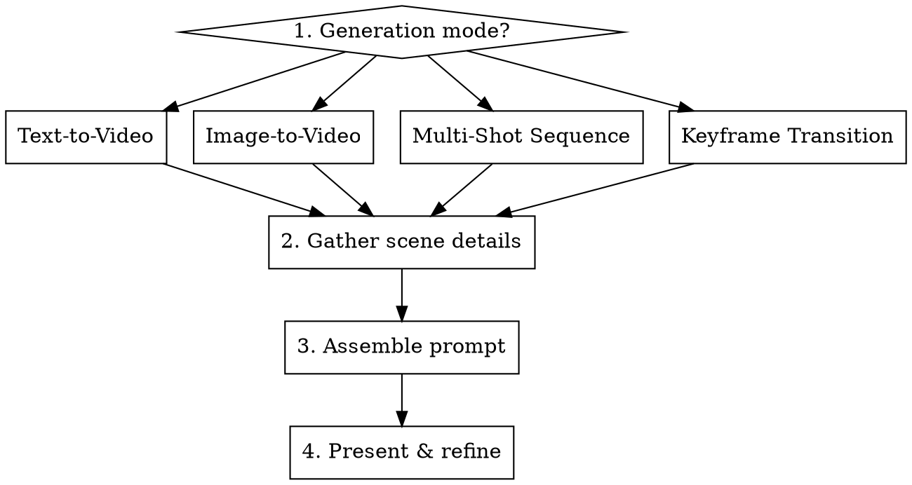

## Overview

Kling 3.0 is a unified multimodal video model. It understands **cinematic direction**, not keyword lists. Write prompts like a director — describe what the audience sees, hears, and feels over time.

**Core shift:** Description → Direction. Think "direct a scene" not "describe an image."

## Interactive Builder Workflow

When invoked, guide the user through these steps using `AskUserQuestion`:



### Step 1: Determine Generation Mode

Ask the user which mode:
- **Text-to-Video** — prompt from scratch
- **Image-to-Video** — animate a reference image
- **Multi-Shot Sequence** — 2-6 shot storyboard (up to 15s)
- **Keyframe Transition** — start frame → end frame with interpolated motion

### Step 2: Gather Scene Details

Ask about each element (adapt questions to mode):

| Element | Question | Why it matters |
|---------|----------|----------------|
| **Subject** | Who/what is the focus? Specific appearance details? | Anchors consistency — define distinguishing traits early |
| **Action** | What happens? Describe the timeline (first → then → finally) | Kling 3.0 excels at sequential action over 15s arcs |
| **Environment** | Where? Be specific (not "a street" but "narrow Tokyo alley, steam from grates") | Grounds the scene physically |
| **Camera** | Shot type and movement? (See camera reference below) | Cinematic language produces far better results |
| **Lighting** | What light sources? Name them specifically | "Flickering neon" beats "dramatic lighting" |
| **Mood/Emotion** | What should the audience feel? | Drives color grade, pacing, music |
| **Audio** | Dialogue? Ambient sound? Music? | Kling 3.0 generates native audio + lip-sync |
| **Duration** | How long? (3-15s) | Longer = describe progression over time |
| **Aspect Ratio** | 16:9 / 9:16 / 1:1 / 21:9? | 16:9 cinematic, 9:16 social, 21:9 ultra-wide |

**Image-to-Video:** Focus on how the scene *evolves from* the image — movement, camera motion, environmental change. The model preserves identity/layout from the source.

**Keyframes:** Ask for start and end frame descriptions. Frames should match in color, style, and lighting. Prompt sparingly — Kling infers motion well.

**Multi-Shot:** Define each shot separately with its own framing, subject, action, and duration. Label shots explicitly.

### Step 3: Assemble the Prompt

Use the **Master Formula**:

```
[Scene/Environment] + [Subject & Appearance] + [Action Timeline] + [Camera Movement] + [Audio & Atmosphere] + [Technical Specs]
```

**Writing rules:**
- Use cinematic motion verbs: dolly push, whip-pan, crash zoom, rack focus, tracking shot — NOT "moves" or "goes"
- Name real light sources: neon signs, candlelight, golden hour, LED panels — NOT "dramatic lighting"
- Include texture for credibility: grain, lens flares, condensation, fabric sheen, smoke, sweat
- Describe temporal flow: beginning → middle → end
- Keep to 1-3 rich sentences per shot (specificity > length)
- For dialogue: use character labels, assign voice tone/emotion, use transitional words ("Immediately," "Pause")

### Step 4: Present & Refine

Present the assembled prompt. Ask if they want to:
- Adjust any element
- Add a negative prompt
- Generate variations (different duration, different camera, different mood)

## Quick Reference

### Camera Movements

| Movement | Effect | Example phrase |
|----------|--------|---------------|
| Dolly push-in | Builds intimacy/tension | "slow dolly push-in toward her face" |
| Dolly zoom | Vertigo/dramatic reveal | "dolly zoom creating disorienting depth shift" |
| Tracking shot | Follows subject laterally | "camera tracks alongside as she walks" |
| Whip-pan | Energy/surprise | "whip-pan to reveal the door" |
| Crash zoom | Shock/emphasis | "sudden crash zoom on the object" |
| Rack focus | Shift attention | "rack focus from foreground hand to background figure" |
| Handheld/shoulder-cam | Raw/documentary feel | "handheld shoulder-cam with subtle sway" |
| Static tripod | Composed/observational | "locked-off static tripod, wide shot" |
| FPV drone | High-energy immersion | "dynamic FPV drone shot chasing through corridor" |
| Low-angle tracking | Heroic/imposing | "low-angle tracking shot, subject towers above" |
| Truck left/right | Lateral reveal | "camera trucks right revealing the cityscape" |
| Tilt up/down | Vertical reveal | "slow tilt up from boots to face" |

### Lens & Film Stock

| Phrase | Effect |
|--------|--------|
| "Shot on 35mm film" | Warm grain, organic texture |
| "Macro 85mm lens" | Tight detail, shallow depth of field |
| "Wide-angle steadicam" | Smooth, immersive, spatial |
| "Handheld camcorder" | Raw VHS energy, nostalgic |
| "Anamorphic lens flare" | Cinematic horizontal streaks |

### Lighting

Use specific sources, not adjectives:
- "Golden hour sun cutting through dusty warehouse windows"
- "Flickering neon casting magenta/cyan across wet pavement"
- "Single bare bulb swinging, casting moving shadows"
- "Cool blue LED panels reflecting off glass surfaces"
- "Candlelight warming skin tones, deep shadows beyond"

### Color & Grade

- "Desaturated teal grade, crushed blacks"
- "Amber nightclub strobe cutting through smoke"
- "Cool blue haze filling the corridor"
- "Magenta neon reflecting off wet asphalt"
- "Overexposed highlights, blown-out whites"

## Multi-Character Dialogue

| Rule | Do | Don't |
|------|-----|-------|
| Name characters | `[Character A: Silver-haired CEO]` | `[Man] says...` |
| Anchor to action | *Agent slams table.* **[Agent, angrily]:** "Where is it?" | Just dialogue without visual action |
| Assign voice tone | `[CEO, deep authoritative gravelly voice]` | Generic "says" |
| Control timing | "Immediately," "Pause," "After a beat" | Back-to-back dialogue without transitions |

## Multi-Shot Structure

```
Shot 1 (0-5s): [Wide establishing shot description]
Shot 2 (5-10s): [Medium/close-up with action progression]
Shot 3 (10-15s): [Resolution/reaction with camera payoff]

Atmosphere: [Overall mood, color grade]
Audio: [Sound design, music, dialogue]
```

Label every shot. Assign durations. Describe framing + subject + motion per shot.

## Start & End Frame Tips

- Frames should match in color palette, style, and lighting
- Identical start/end frames = seamless loop
- Prompt sparingly — Kling infers motion between frames well
- Simple camera directions: zoom in/out, pan left/right, tilt up/down
- 5s for dynamic transitions, 10s for complex transformations
- Start frame aspect ratio drives the whole clip

## Negative Prompts

Use to prevent common AI defaults:

```
smiling, laughing, cartoonish, bright saturated colors, low resolution,
morphing, blurry text, disfigured hands, extra fingers, static pose,
frozen expression, stock photo aesthetic
```

Customize based on scene — remove items that conflict with your intent.

## Weak → Strong

| Element | Weak | Strong |
|---------|------|--------|
| Camera | "Camera follows person" | "Handheld shoulder-cam drifts behind subject with subtle sway" |
| Subject | "A woman walking" | "Woman in red dress, heels clicking wet cobblestone" |
| Environment | "In a city" | "Narrow Tokyo alley, steam from grates, glowing vending machines" |
| Lighting | "Dramatic lighting" | "Flickering neon casting magenta/cyan across wet pavement" |
| Texture | "It looks realistic" | "Rain beading on leather jacket, condensation on glass, visible breath" |
| Motion | "She walks away" | "She turns slowly, hair catches light, disappears around corner" |

## Common Mistakes

| Mistake | Fix |
|---------|-----|
| Keyword lists instead of scene direction | Write like directing a shot: subject + action + camera + environment |
| Vague motion ("moves," "goes") | Use cinematic verbs: dolly, track, whip-pan, crash zoom |
| Generic lighting ("dramatic") | Name the source: neon, candle, golden hour, LED panel |
| Overlong prompts | 1-3 rich sentences per shot; specificity > length |
| No temporal progression | Describe beginning → middle → end of the shot |
| Mismatched keyframes | Match color, lighting, and style between start/end frames |
| Unattributed dialogue | Label every speaker with name, tone, and emotion |
| Cramming multi-shot into one paragraph | Separate and label each shot with duration |
