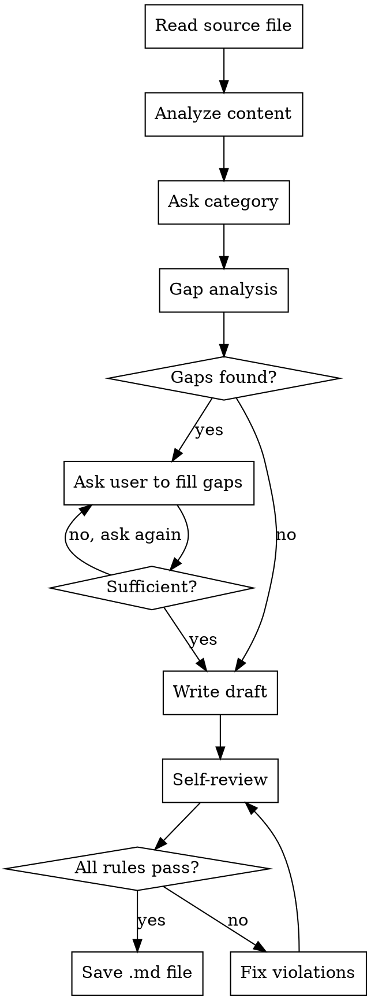

# Blog Post Writer

## Overview

Transform technical content into a polished blog post for senior engineers. Accept input as a file or plain text, ask the user to confirm category, then write the post following the category template.

## Invocation

Three ways to provide source content:

```
/blog @path/to/source.md          # markdown file
/blog @path/to/notes.txt          # text file
/blog <paste plain text here>     # plain text directly
```

`$ARGUMENTS` may contain a file path or plain text. Determine which:
- If it looks like a file path (contains `/` or `.md` or `.txt`), read the file.
- Otherwise, treat `$ARGUMENTS` itself as the source content.

## Workflow



1. **Read** the source content from `$ARGUMENTS` (file path → read file; plain text → use directly)
2. **Analyze** content: identify language, key topics, available data
3. **Ask** user to confirm category (case / study / guide) via AskUserQuestion — suggest your best guess as the first option
4. **Gap analysis** — compare source content against the chosen category template. Identify which sections lack sufficient information to write a useful post.
5. **Fill gaps** — if gaps exist, ask the user one question at a time via AskUserQuestion until every template section has enough material. Use multiple choice when possible. Do NOT proceed to writing until the content is sufficient.
6. **Write draft** — write the post following all rules in the Iron Rules section, incorporating both the source file and the user's answers
7. **Self-review** — review the draft against the Self-Review Checklist below. Do NOT show the draft to the user yet.
8. **Fix & repeat** — if any checklist item fails, fix the violation and re-review. Repeat until every item passes.
9. **Save** the final post to user-specified path, or default: `blog/posts/YYYY-MM-DD-<slug>.md`

### Self-Review Checklist

After writing the draft, check every item below. If any item fails, fix it and re-check the full list.

**Content Integrity:**
- [ ] No fabricated content — every claim traces back to the source or user's answers
- [ ] Code blocks are identical to the source (except redacted secrets)
- [ ] No secrets in output — API keys, tokens, passwords, connection strings replaced with `<REDACTED>`
- [ ] Post length is proportional to source length (no padding)

**Writing Style (Strunk):**
- [ ] Active voice throughout — no "was implemented", "was observed"
- [ ] Positive form — no "don't forget to", "it is not uncommon"
- [ ] Specific and concrete — no "significantly improved", "much faster"
- [ ] No needless words — every sentence earns its place
- [ ] Emphatic word at end of each key sentence
- [ ] One paragraph, one topic — no paragraph covers two subjects
- [ ] Topic sentence leads each paragraph
- [ ] Parallel structure in all lists — items share the same grammatical form
- [ ] Related words kept together — modifiers next to what they modify
- [ ] No loose sentence chains — no run-on compound sentences
- [ ] Consistent tense within each section

**Banned Patterns:**
- [ ] Zero AI puffery (groundbreaking, seamless, pivotal, vital, testament)
- [ ] Zero overused AI words (delve, leverage, multifaceted, foster, realm, tapestry)
- [ ] Zero empty -ing phrases (ensuring reliability, showcasing features)
- [ ] No filler intros ("In recent years...", "As we all know...")
- [ ] No restating conclusion
- [ ] No puffery-as-emphasis (non-negotiable, crucial, indispensable)
- [ ] No promotional adjectives (robust, powerful, state-of-the-art)
- [ ] No formatting overuse (excessive bullets, bold on every line, emoji)

**Structure:**
- [ ] Frontmatter matches the spec exactly (no extra fields)
- [ ] Template sections are all present (or intentionally skipped by user)
- [ ] Hook is specific and pulls the reader in
- [ ] TL;DR is 3 bullets max
- [ ] Section lengths vary (not all the same)

### Gap Analysis Guide

After choosing the category, map the source content to each template section. Flag sections where:

- **No data at all** — template section has zero corresponding content in source
- **Too vague** — source mentions something but lacks specifics (e.g., "performance improved" without numbers)
- **Missing context** — reader would ask "why?" or "compared to what?" and the source doesn't answer

Ask the user to fill these gaps. One question at a time. Prefer multiple choice. Example:

> "The Results section needs numbers. Do you have benchmark data?"
> - Yes (I'll provide it)
> - Not yet measured (skip Results section)
> - Only rough estimates

If the user says to skip a section, omit it from the final post rather than writing filler.

## Iron Rules

These are non-negotiable. Violating any one of these means the post needs to be rewritten.

### Content Integrity

- **Never fabricate.** Use only what exists in the source. If the source says "benchmark: p50 3ms", write about that result. Do not invent context, backstory, or details.
- **Preserve code blocks exactly.** No renaming variables, no adding lines, no removing lines. Format/comment cleanup only.
- **Do not over-expand.** A 30-line source does not become a 120-line post. Add structure and connective tissue, not padding.

### Writing Style

Follow Strunk's principles:

- **Active voice.** "We reduced latency" not "Latency was reduced."
- **Omit needless words.** Cut every sentence that repeats what was already said.
- **Specific over vague.** "p99 dropped from 45ms to 8ms" not "performance improved significantly."
- **Positive form.** "Use sync.Pool" not "Don't forget to consider sync.Pool."
- **Place emphasis at end of sentence.** The important word goes last.
- **One paragraph, one topic.** A paragraph that covers both "why we chose Go" and "how batching works" must be split.
- **Topic sentence first.** Start each paragraph with its main point. Supporting details follow.
- **Parallel structure.** List items must share the same grammatical form. All nouns, all verbs, or all imperative — pick one and hold it.
- **Keep related words together.** Place modifiers next to what they modify. "A server written in Go that handles 4200 req/s" not "A server that handles 4200 req/s written in Go."
- **No loose sentence chains.** Avoid run-on compound sentences. Break into shorter sentences with varied structure.
- **One tense per section.** Pick past or present and stick with it within a section. Do not mix.

### Banned Patterns

| Pattern | Example | Why |
|---------|---------|-----|
| AI puffery | groundbreaking, seamless, cutting-edge, pivotal, vital, testament | Empty hype |
| Overused AI words | delve, leverage, multifaceted, foster, realm, tapestry | Statistically generic |
| Empty -ing phrases | ensuring reliability, showcasing features, highlighting capabilities | Says nothing concrete |
| Filler intros | "In recent years, AI has...", "As we all know..." | Wastes reader's time |
| Conclusion that repeats | "In conclusion, we showed that..." | Reader already read it |
| Puffery disguised as emphasis | non-negotiable, vital, crucial, indispensable | Use specifics instead |
| Promotional adjectives | robust, powerful, state-of-the-art | Not your job to sell |
| Formatting overuse | Excessive bullets, bold on every line, emoji | Let the content carry weight |

### Credential Safety

- **Redact secrets before output.** If the source content contains patterns that look like API keys, tokens, passwords, or connection strings, replace them with `<REDACTED>` in the output and warn the user.
- Never reproduce `.env` variables, Bearer tokens, or private keys in the final blog post.

### Tone

Write as a senior engineer sharing with peers. Not a blog marketer, not a professor, not a salesperson. Assume the reader is smart and busy.

## Frontmatter

Always generate this exact structure:

```yaml
---
title: "<concise, descriptive title>"
date: YYYY-MM-DD
description: "<one sentence summary — what this post delivers to the reader>"
category: case | study | guide
tags:
  - tag1
  - tag2
  - tag3
draft: true
featured: false
---
```

- If the source has frontmatter, preserve and fill gaps
- If not, generate from content
- **Do not add fields not listed above** (no `author`, no `slug`, no `image`)
- Match the language of the source content

## Category Templates

### `case` — Experience / Case Study

"We did X, and here's what happened." Implementation stories, migrations, incident response, performance improvements.

```
# [Title]

[Hook — 1-2 sentences. An unexpected result, a hard constraint, or a specific problem that pulls the reader in.]

## TL;DR
- 3 bullets max. Busy reader stops here if not relevant.

## Problem & Constraints
- The specific problem being solved
- Real constraints (latency budget, team size, existing system, etc.)

## Approach & Trade-offs
- What approach was chosen and what alternatives were considered
- Why this one won (concrete trade-off reasoning)

## Implementation
- Key code with brief explanation
- Design decisions that matter

## Results
- Benchmarks, metrics, before/after (use tables when comparing)

## Lessons Learned
- What actually surprised you
- What you would do differently

## Takeaways
- Actionable insights the reader can apply to their own work
```

### `study` — Learning / Deep Dive

"I dug into X, and here's the core idea." Paper reviews, new technology analysis, concept deep dives.

```
# [Title]

[Hook — What triggered this study, in 1-2 sentences.]

## TL;DR
- 3 bullets max.

## Core Idea
- The central concept, explained clearly

## Deep Dive
- Technical details, code/math/diagrams

## Practical Implications
- Why this matters for working engineers

## Critical Analysis
- Strengths, weaknesses, open questions

## Takeaways
- Key points + recommended resources (if any)
```

### `guide` — How-to / Tutorial

"Here's how to do X." Environment setup, library usage, best practices — content the reader can follow along with.

```
# [Title]

[Hook — 1-2 sentences. What problem this guide solves and who it's for.]

## TL;DR
- 3 bullets max. What you'll be able to do after reading this.

## Prerequisites
- What the reader needs before starting (tools, versions, knowledge)

## Steps
- Step-by-step with code blocks
- Each step: what to do, why, and expected result
- Group related steps under subheadings if needed

## Troubleshooting
- Common errors and how to fix them
- Edge cases worth knowing

## Takeaways
- Summary of what was covered
- Next steps or further reading
```

## Output Language

Match the source file's language. Korean source → Korean post. English source → English post. Mixed → follow the dominant language.

## Red Flags — Rewrite If You Catch Yourself Doing This

- Adding a "Conclusion" section that restates what was already said
- Writing 3 paragraphs where 3 sentences would do
- Inventing quotes, scenarios, or backstory not in the source
- Starting with "In the rapidly evolving world of..."
- Using more than 2 adjectives in a single sentence
- Every section having the same length (vary rhythm)
