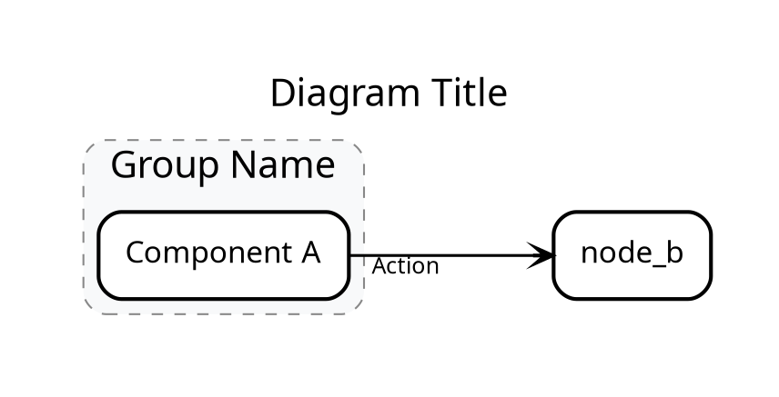

## When to use

This skill defines the **mandatory** workflow for creating professional "ByteByteGo-style" system design diagrams.
When asked to visualize a project, you must **decompose** the system into **3-4 distinct aspects** and generate separate Graphviz DOT files for each.

**Standard:** We use **Graphviz (DOT)** for structure + **Excalidraw** attributes for style.
**Prohibited:** Do NOT use Python `diagrams` library, Mermaid, or basic ASCII art.

## Core Workflow

1. **Explore**: Use `find`, `grep`, and `read` to understand the codebase structure and key components.
2. **Identify Aspects**: Select 3-4 distinct perspectives to visualize (see "Standard Aspects" below).
    * *Note*: If the user asks for "deep dive", "internals", or "how it works", prioritize the **Deep Dive** aspects.
3. **Structure (DOT)**: Write a strict Graphviz DOT file for **each** aspect.
4. **Output**: Write the files to disk (e.g., `project_architecture.dot`, `project_memory.dot`) and present the content to the user.

## Standard Aspects (Choose 3-4)

Do not try to cram everything into one graph. Create separate files for clarity.

### High-Level Views

1. **System Architecture** (`*_architecture.dot`)
    * **Focus**: Modules, subsystems, external boundaries, API Gateway, Databases.
    * **Goal**: The "Big Picture" view for new users.

2. **Type System & Relationships** (`*_types.dot`)
    * **Focus**: Inheritance, composition, ownership, class hierarchy.
    * **Goal**: Understanding the static code structure.

3. **Data Flow Pipeline** (`*_flow.dot`)
    * **Focus**: Request lifecycle, processing stages, queues, event loops.
    * **Goal**: Runtime behavior and data movement.

### Deep Dive Views (Prioritize for "Deep" requests)

4. **Memory Model & Physical Layout** (`*_memory.dot`)
    * **Focus**: Buffers, chunks, pointers, offsets, serialization formats, cache lines.
    * **Goal**: Visualizing low-level efficiency and storage mechanics.
    * **Example**: "How `VectorStorage` chunks 1024 docs" or "How a request packet is serialized".

5. **Complex Data Structure Implementation** (`*_struct.dot`)
    * **Focus**: Internal pointer chains, tree rotations, hash map buckets, linked lists hidden inside classes.
    * **Goal**: Explaining the *implementation details* of a core component.
    * **Example**: "The linked-list implementation of SubDocuments".

6. **State Machine & Lifecycle** (`*_state.dot`)
    * **Focus**: Detailed states (Allocated -> Constructed -> Ready -> Destructed -> Freed).
    * **Goal**: Resource management and logical transitions.

## The "ByteByteGo" Style in DOT

To achieve the clean, orthogonal, architectural look, you MUST use these attributes in **every** file:

## Rendering Instructions

Always advise the user on how to render the output:

1. "Paste this DOT code into **Edotor.net** or **GraphvizOnline** to view."
2. "For the full Excalidraw experience, use a DOT-to-Excalidraw converter or drag the SVG into Excalidraw."

## Red Flags - STOP and Start Over

* **Edge Labels**: You MUST use `xlabel` instead of `label` for edges. Standard `label` distorts the orthogonal layout.
* **Single Monolithic Graph**: If you are trying to fit the class hierarchy AND the network topology in one graph, STOP. Split it.
* **Curved Lines**: `splines="ortho"` is non-negotiable for this style.
* **Standard Fonts**: If `fontname="Virgil"` is missing, it's not the requested style.
* **Reserved Keywords**: Do not name nodes `graph`, `node`, or `edge`. Use `my_graph`, `node_cls`, etc.
