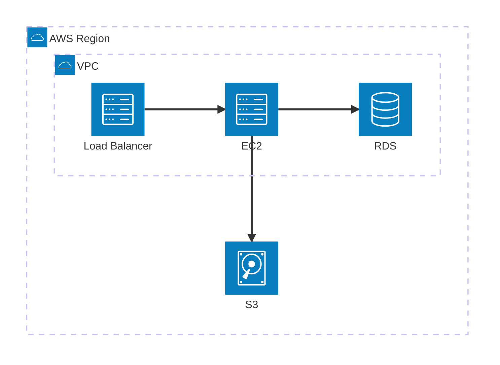

# /diagram - Mermaid Diagram Utility

> **Skill Awareness**: See `skills/_registry.md` for all available skills.
> - **Use with**: `/dev-scout` for architecture visualization
> - **Use with**: `/dev-specs` for flow diagrams
> - **Related**: `/docs-graph` for document relationships

Create, validate, and fix Mermaid diagrams in markdown files.

## Prerequisites

```bash
npm install -g @mermaid-js/mermaid-cli
```

Verify: `mmdc --version`

## Usage

```
/diagram validate path/to/file.md     # Validate diagrams in file
/diagram validate                      # Validate file from context
/diagram fix path/to/file.md          # Validate and auto-fix
```

## Workflow

### Validate Mode

1. Read the markdown file
2. Extract all mermaid code blocks
3. For each diagram, run: `mmdc -i <temp-file> -o /tmp/mermaid-out.svg 2>&1`
4. Report results:
   - Valid: Confirm with checkmark
   - Invalid: Show error, location, and what's wrong

### Fix Mode

1. Validate first
2. For invalid diagrams:
   - Identify the error type (see `references/common-errors.md`)
   - Apply fix
   - Re-validate
3. Repeat until all diagrams pass
4. Update the file with fixes

## Supported Diagram Types

### Core Diagrams

| Type | Keyword | Use For |
|------|---------|---------|
| Flowchart | `flowchart` | Process flows, decisions |
| Sequence | `sequenceDiagram` | API flows, interactions |
| State | `stateDiagram-v2` | Status lifecycle |
| ER Diagram | `erDiagram` | Database schema |
| Class | `classDiagram` | Object structures |

### Charts & Visualization

| Type | Keyword | Use For |
|------|---------|---------|
| Pie | `pie` | Distribution |
| XY Chart | `xychart-beta` | Line/bar charts, trends |
| Quadrant | `quadrantChart` | Priority matrix, effort/impact |
| Sankey | `sankey-beta` | Flow visualization, funnels |

### Architecture & Systems

| Type | Keyword | Use For |
|------|---------|---------|
| **Architecture** | `architecture-beta` | **AWS/Cloud diagrams, CI/CD** |
| Block | `block-beta` | System blocks, layouts |
| C4 | `C4Context` / `C4Container` | Software architecture levels |
| Packet | `packet-beta` | Network protocols |

### Planning & Documentation

| Type | Keyword | Use For |
|------|---------|---------|
| Gantt | `gantt` | Project timelines |
| Timeline | `timeline` | Milestones, phases |
| Journey | `journey` | User experience mapping |
| Mindmap | `mindmap` | Feature breakdown |
| Git Graph | `gitGraph` | Branch strategies |
| Requirement | `requirementDiagram` | Requirements tracking |
| Kanban | `kanban` | Task boards |

See `references/diagram-types.md` for complete syntax and examples.

## Architecture Diagrams (AWS/Cloud)

The `architecture-beta` type is specifically designed for cloud infrastructure diagrams.

### Basic Components



### Syntax Quick Reference

| Element | Syntax |
|---------|--------|
| Group | `group id(icon)[Label]` |
| Nested group | `group id(icon)[Label] in parent` |
| Service | `service id(icon)[Label]` |
| Service in group | `service id(icon)[Label] in group` |
| Edge | `svc1:R --> L:svc2` |
| Junction | `junction id` |

### Default Icons

`cloud`, `database`, `disk`, `internet`, `server`

### Edge Directions

`L` (left), `R` (right), `T` (top), `B` (bottom)

### Custom AWS Icons

For actual AWS icons, use Iconify integration:
```
service lambda(logos:aws-lambda)[Lambda]
service s3(logos:aws-s3)[S3]
```

Note: Custom icons require registering icon packs in the Mermaid config.

## Validation Script

```bash
# Extract and validate mermaid blocks
# Save mermaid content to temp file, then:
mmdc -i /tmp/mermaid-temp.mmd -o /tmp/mermaid-out.svg 2>&1

# Exit code 0 = valid, non-zero = error
# Stderr contains error details
```

## Error Handling

When validation fails, the error message indicates:
- Line number in the diagram
- Error type (syntax, unknown keyword, etc.)
- Suggestion for fix

Load `references/common-errors.md` for fix patterns.

## Integration

Other skills can use diagram validation:

```markdown
<!-- After creating mermaid diagram -->
1. Write the diagram to file
2. Run: mmdc -i <file> -o /tmp/validate.svg 2>&1
3. If error, fix and retry
4. Continue with skill workflow
```

## Example

```
User: /diagram validate plans/billing/brd/flows/FL-MAIN-001-overview.md

Claude: Validating mermaid diagrams in FL-MAIN-001-overview.md...

Found 2 diagrams:

1. Line 5-15: flowchart LR
   ✓ Valid

2. Line 20-35: sequenceDiagram
   ✗ Error: Parse error on line 8
   → "End" is a reserved word, wrap in quotes: "End"

Fixing diagram 2...
   Applied fix: End → "End"
   Re-validating... ✓ Valid

Updated file. All diagrams now valid.
```

## References

- `references/diagram-types.md` - Syntax for each diagram type
- `references/common-errors.md` - Error patterns and fixes
