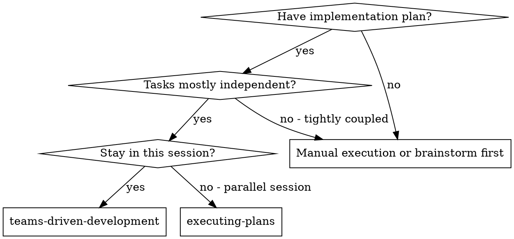
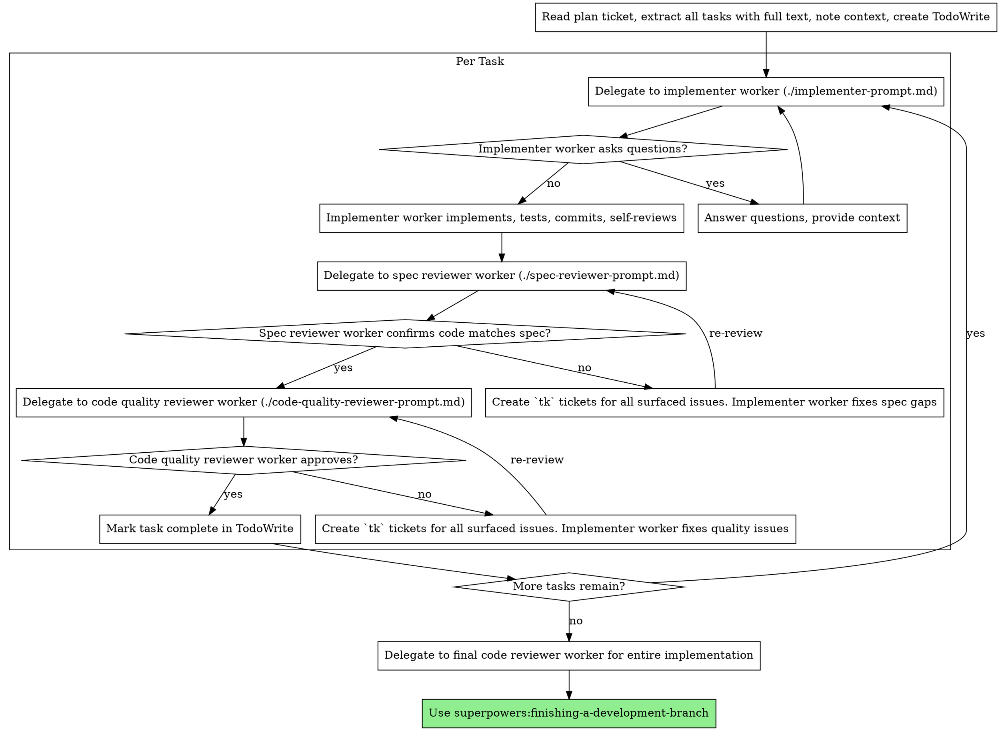

# Teams-Driven Development

Execute plan by delegating fresh worker per task via `teams delegate`, with two-stage review after each: spec compliance review first, then code quality review.

**Core principle:** Fresh worker per task + two-stage review (spec then quality) = high quality, fast iteration

## When to Use



**vs. Executing Plans (parallel session):**

- Same session (no context switch)
- Fresh worker per task (no context pollution)
- Two-stage review after EACH task: spec compliance first, then code quality
- Faster iteration (no human-in-loop between tasks)

## The Process



## Prompt Templates

- `./implementer-prompt.md` - Delegate to implementer worker
- `./spec-reviewer-prompt.md` - Delegate to spec compliance reviewer worker
- `./code-quality-reviewer-prompt.md` - Delegate to code quality reviewer worker

## How to Delegate

Use `teams delegate` for each worker:

```
teams(action: 'delegate', tasks: [
  {text: '<implementer prompt with full task text + context>', assignee: 'implementer-task-1'}
])
```

For reviews:
```
teams(action: 'delegate', tasks: [
  {text: '<spec review prompt>', assignee: 'spec-reviewer-task-1'}
])
```

## Example Workflow

```
You: I'm using Teams-Driven Development to execute this plan.

[Read plan ticket once]
[Extract all 5 tasks with full text and context]
[Create TodoWrite with all tasks]

Task 1: Hook installation script

[Get Task 1 text and context (already extracted)]
[teams delegate implementer worker with full task text + context]

Implementer: "Before I begin - should the hook be installed at user or system level?"

You: "User level (~/.config/superpowers/hooks/)"

Implementer: "Got it. Implementing now..."
[Later] Implementer:
  - Implemented install-hook command
  - Added tests, 5/5 passing
  - Self-review: Found I missed --force flag, added it
  - Committed

[teams delegate spec compliance reviewer]
Spec reviewer: ✅ Spec compliant - all requirements met, nothing extra

[Get git SHAs, teams delegate code quality reviewer]
Code reviewer: Strengths: Good test coverage, clean. Issues: None. Approved.

[Mark Task 1 complete]

Task 2: Recovery modes

[Get Task 2 text and context (already extracted)]
[teams delegate implementer worker with full task text + context]

Implementer: [No questions, proceeds]
Implementer:
  - Added verify/repair modes
  - 8/8 tests passing
  - Self-review: All good
  - Committed

[teams delegate spec compliance reviewer]
Spec reviewer: ❌ Issues:
  - Missing: Progress reporting (spec says "report every 100 items")
  - Extra: Added --json flag (not requested)
  - Create `tk` tickets for all surfaced issues

[Implementer fixes issues]
Implementer: Removed --json flag, added progress reporting

[Spec reviewer reviews again]
Spec reviewer: ✅ Spec compliant now

[teams delegate code quality reviewer]
Code reviewer: Strengths: Solid. Issues (Important): Magic number (100)

[Implementer fixes]
Implementer: Extracted PROGRESS_INTERVAL constant

[Code reviewer reviews again]
Code reviewer: ✅ Approved

[Mark Task 2 complete]

...

[After all tasks]
[teams delegate final code-reviewer]
Final reviewer: All requirements met, ready to merge

Done!
```

## Advantages

**vs. Manual execution:**

- Workers follow TDD naturally
- Fresh context per task (no confusion)
- Parallel-safe (workers don't interfere)
- Worker can ask questions (before AND during work)

**vs. Executing Plans:**

- Same session (no handoff)
- Continuous progress (no waiting)
- Review checkpoints automatic

**Efficiency gains:**

- No file reading overhead (controller provides full text)
- Controller curates exactly what context is needed
- Worker gets complete information upfront
- Questions surfaced before work begins (not after)

**Quality gates:**

- Self-review catches issues before handoff
- Two-stage review: spec compliance, then code quality
- Review loops ensure fixes actually work
- Spec compliance prevents over/under-building
- Code quality ensures implementation is well-built

**Cost:**

- More worker invocations (implementer + 2 reviewers per task)
- Controller does more prep work (extracting all tasks upfront)
- Review loops add iterations
- But catches issues early (cheaper than debugging later)

## Red Flags

**NEVER:**

- Skip reviews (spec compliance OR code quality)
- Proceed with unfixed issues
- Delegate multiple implementer workers in parallel on the same codebase (conflicts)
- Make worker read plan file (provide full text instead)
- Skip scene-setting context (worker needs to understand where task fits)
- Ignore worker questions (answer before letting them proceed)
- Accept "close enough" on spec compliance (spec reviewer found issues = not done)
- Skip review loops (reviewer found issues = implementer fixes = review again)
- Let implementer self-review replace actual review (both are needed)
- **Start code quality review before spec compliance is ✅** (wrong order)
- Move to next task while either review has open issues

**If worker asks questions:**

- Answer clearly and completely
- Provide additional context if needed
- Don't rush them into implementation

**If reviewer finds issues:**

- Implementer (same worker) fixes them
- Reviewer reviews again
- Repeat until approved
- Don't skip the re-review

**If worker fails task:**

- Delegate fix worker with specific instructions
- Don't try to fix manually (context pollution)

## Integration

**Required workflow skills:**

- **superpowers:writing-plans** - Creates the plan this skill executes
- **superpowers:requesting-code-review** - Code review template for reviewer workers
- **superpowers:finishing-a-development-branch** - Complete development after all tasks

**Workers should use:**

- **superpowers:test-driven-development** - Workers follow TDD for each task

**Alternative workflow:**

- **superpowers:executing-plans** - Use for parallel session instead of same-session execution

After completing each review stage, follow handbook `15.04` to create `tk` tickets for all surfaced issues.
