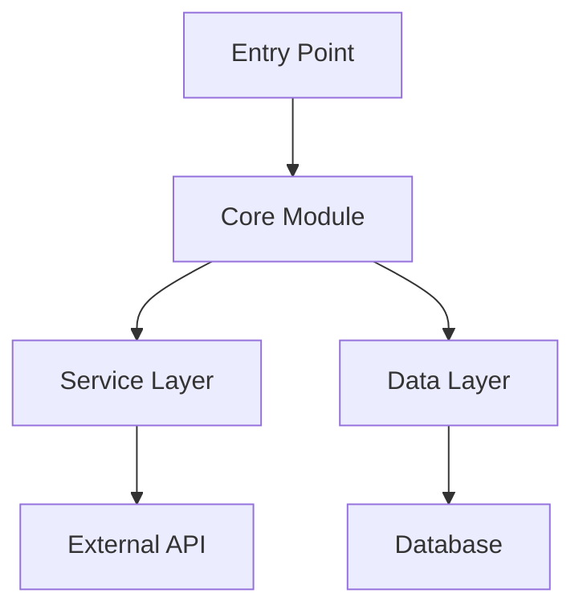

# Software Tool Research

Systematic workflow for analyzing software tools and repositories to understand architecture, document functionality, and measure quality attributes.

## Core Workflows

### 1. Repository Discovery and Initial Assessment

**When to use:** Starting analysis of a new software tool or repository.

**Process:**
1. Identify repository structure using `file_search` and `list_dir`
2. Read key files: README, package files, main entry points
3. Identify programming language(s) and frameworks
4. Locate documentation and configuration files

**Key files to examine:**
- README.md, CONTRIBUTING.md, docs/
- package.json, requirements.txt, pyproject.toml, pom.xml
- .github/workflows/ (CI/CD)
- docker-compose.yml, Dockerfile
- Main entry points (main.py, index.js, App.tsx)

### 2. Architecture Understanding

**When to use:** Need to understand how the software is organized and designed.

**Systematic extraction:**

```markdown
## Architecture Analysis: [TOOL NAME]

### 1. High-Level Overview
- **Purpose**: What problem does it solve?
- **Type**: Library, framework, application, service
- **Core technology**: Language, frameworks, runtime
- **Architecture pattern**: MVC, microservices, layered, plugin-based

### 2. Module Structure
- **Main components**: List and describe key modules/packages
- **Responsibilities**: What each component does
- **Directory organization**: Explain folder structure

### 3. Dependency Graph
- **External dependencies**: Key libraries and frameworks
- **Internal dependencies**: How modules relate
- **Dependency management**: How dependencies are declared

### 4. Data Flow
- **Entry points**: Where requests/data enter system
- **Processing pipeline**: How data moves through system
- **Exit points**: Where results/responses are generated

### 5. Extension Points
- **Plugin system**: If exists, how it works
- **Configuration**: How behavior can be customized
- **APIs**: Public interfaces for integration
```

**Tools sequence:**
1. `semantic_search` - Find architectural patterns and design decisions
2. `read_file` - Read main files and documentation
3. `grep_search` - Locate specific patterns (class definitions, imports)
4. `list_code_usages` - Understand how components interact

**For detailed architectural patterns:** See [ARCHITECTURE_PATTERNS.md](references/ARCHITECTURE_PATTERNS.md)

### 3. Architectural Model Generation

**When to use:** Need visual or formal representation of the architecture.

**Model types to generate:**

**A) Component Diagram (Mermaid)**


**B) Package Structure (Tree)**
```
tool-name/
├── src/
│   ├── core/          # Core business logic
│   ├── services/      # External integrations
│   ├── models/        # Data structures
│   └── utils/         # Helper functions
├── tests/
└── docs/
```

**C) Dependency Map (Table)**
| Component | Depends On | Provides | Used By |
|-----------|------------|----------|---------|
| Core | Models, Utils | Business logic | Services, API |
| Services | Core, External APIs | Integrations | Controllers |

**For advanced modeling techniques:** See [MODELING_GUIDE.md](references/MODELING_GUIDE.md)

### 4. Functional Analysis

**When to use:** Need to understand what the tool does and how.

**Structured documentation:**

```markdown
## Functional Analysis: [TOOL NAME]

### 1. Core Capabilities
- **Feature 1**: Description, input/output, example
- **Feature 2**: Description, input/output, example
- **Feature 3**: Description, input/output, example

### 2. API Surface
- **Public functions/methods**: List with signatures
- **Configuration options**: Available settings
- **CLI commands**: If command-line tool

### 3. Usage Examples
#### Basic Usage
[code example]

#### Advanced Usage
[code example]

### 4. Integration Points
- **Input interfaces**: How data enters
- **Output interfaces**: How results are provided
- **External services**: What it connects to

### 5. Error Handling
- **Exception types**: What errors can occur
- **Recovery mechanisms**: How errors are handled
- **Logging**: What information is logged
```

**Tools to use:**
- `grep_search` - Find function definitions, API endpoints
- `semantic_search` - Locate examples and usage patterns
- `read_file` - Read tests to understand expected behavior

### 5. Quality Metrics Measurement

**When to use:** Need to assess tool quality, maintainability, or health.

**Metrics to collect:**

```markdown
## Quality Metrics: [TOOL NAME]

### 1. Code Metrics
- **Lines of code**: Total, per component
- **File count**: Total files, average size
- **Complexity indicators**: Deep nesting, long functions
- **Code duplication**: Repeated patterns

### 2. Documentation Coverage
- **README quality**: Completeness, examples, setup guide
- **API documentation**: Inline comments, docstrings
- **User guides**: Tutorials, how-tos
- **Architecture docs**: Design decisions, diagrams

### 3. Testing Metrics
- **Test presence**: Unit, integration, e2e tests
- **Test coverage**: If reported in repo
- **Test patterns**: Mocking, fixtures used
- **CI/CD**: Automated testing pipeline

### 4. Maintenance Health
- **Commit activity**: Recent commits, frequency
- **Issue tracker**: Open vs closed issues
- **Dependencies**: Up-to-date, security vulnerabilities
- **Release cadence**: Version history

### 5. Community Health
- **Contributors**: Number, activity
- **Documentation**: Contributor guide, code of conduct
- **Responsiveness**: Issue response time
- **License**: Type, clarity

### Quality Score Summary
- Documentation: [1-5] ⭐
- Testing: [1-5] ⭐
- Maintainability: [1-5] ⭐
- Community: [1-5] ⭐
```

**Measurement approach:**
1. Use `grep_search` to count tests, find TODO/FIXME
2. Check `.github/workflows/` for CI/CD
3. Read package files for dependency info
4. Use `file_search` to assess documentation coverage
5. Use `get_changed_files` if analyzing git repository

**For detailed metric definitions:** See [METRICS_GUIDE.md](references/METRICS_GUIDE.md)

### 6. Comprehensive Report Generation

**When to use:** Need complete analysis report for stakeholders.

**Complete report structure:**

```markdown
# Software Tool Analysis: [TOOL NAME]

## Executive Summary
- **Tool purpose**: One sentence
- **Key strengths**: 2-3 bullet points
- **Key concerns**: 2-3 bullet points
- **Recommendation**: Adopt/evaluate/avoid with reasoning

## 1. Overview
### 1.1 Basic Information
- Repository: [URL]
- Language: [Primary language]
- License: [License type]
- Latest version: [Version]
- Last updated: [Date]

### 1.2 Purpose and Scope
[2-3 paragraphs explaining what it does and why it exists]

## 2. Architecture
[Insert Architecture Analysis from Workflow 2]

## 3. Technical Implementation
[Insert Functional Analysis from Workflow 4]

## 4. Quality Assessment
[Insert Quality Metrics from Workflow 5]

## 5. Usage and Integration
### 5.1 Installation
[Steps to install]

### 5.2 Basic Usage
[Code examples]

### 5.3 Integration Examples
[How to integrate into projects]

## 6. Comparison with Alternatives
| Feature | This Tool | Alternative 1 | Alternative 2 |
|---------|-----------|---------------|---------------|
| [Feature] | ... | ... | ... |

## 7. Risk Assessment
- **Technical risks**: Dependencies, complexity, performance
- **Maintenance risks**: Activity, community, support
- **Security risks**: Vulnerabilities, audit history

## 8. Recommendations
### For Adoption
- Best use cases
- Team requirements
- Migration path

### For Development
- Contribution opportunities
- Enhancement suggestions
- Documentation improvements

## Appendix
- Key files examined
- Tools and methods used
- Analysis date
```

**Generation approach:**
1. Execute workflows 1-5 in sequence
2. Synthesize findings into structured report
3. Add comparisons if alternatives known
4. Include actionable recommendations

## Best Practices

### Efficient Context Gathering
- Start broad (file structure, README) then narrow
- Parallelize independent reads when possible
- Use `semantic_search` for concepts, `grep_search` for patterns
- Read tests to understand intended behavior

### Architecture Discovery
- Look for README or architecture docs first
- Examine entry points to understand flow
- Follow imports/dependencies to map relationships
- Check for design pattern documentation

### Quality Assessment
- Focus on measurable indicators
- Compare against industry standards
- Consider project context (age, purpose, team size)
- Look for red flags: no tests, stale deps, no docs

### Report Writing
- Lead with executive summary for stakeholders
- Use diagrams for complex relationships
- Provide code examples for key features
- Base conclusions on evidence gathered

## Limitations

- Cannot execute code to measure runtime performance
- Dependency on repository accessibility and documentation
- Metrics are snapshot in time, not historical trends
- Quality assessment is semi-qualitative without automated tools
