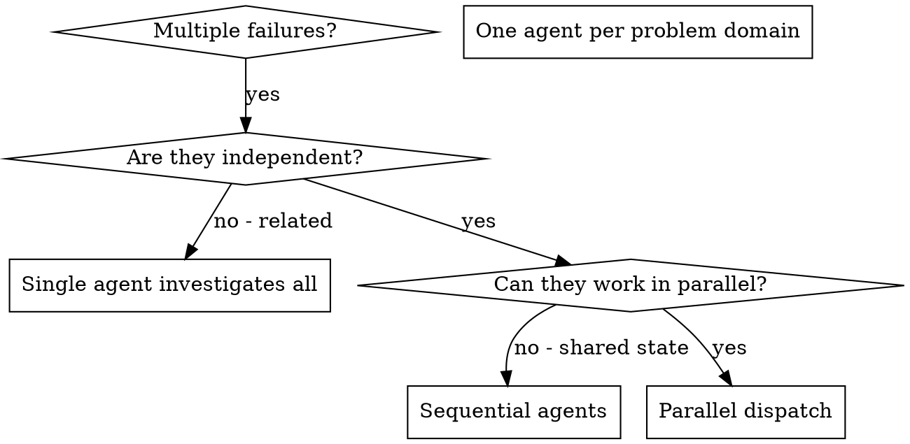

# Dispatching Parallel Agents

## Overview

When you have multiple unrelated failures (different test files, different subsystems, different bugs), investigating them sequentially wastes time. Each investigation is independent and can happen in parallel.

**Core principle:** Dispatch one agent per independent problem domain. Let them work concurrently.

## When to Use



**Use when:** 3+ failures with different root causes, multiple independent subsystems broken, no shared state between investigations.

**Don't use when:** failures are related, need full system context, agents would interfere (editing same files).

## The Pattern

### 1. Identify Independent Domains
Group failures by what's broken. Each domain is independent — fixing one doesn't affect others.

### 2. Create Focused Agent Tasks
Each agent gets: **specific scope** (one file/subsystem), **clear goal**, **constraints** (don't change other code), **expected output** (summary of findings and fixes). Include a return format constraint: token budget (e.g., "under 1000 tokens") and structure (e.g., "verdict first, then details").

**Model selection:** Use Opus for implementation agents, Sonnet for review/analysis agents, Haiku for simple validation or formatting tasks.

Use the [dispatch prompt template](../skills-management/references/dispatch-prompt-template.md) for the canonical 6-section prompt structure.

### 3. Dispatch in Parallel
```typescript
Task("Fix agent-tool-abort.test.ts failures")
Task("Fix batch-completion-behavior.test.ts failures")
Task("Fix tool-approval-race-conditions.test.ts failures")
```

### 4. Review and Integrate
Read each summary, verify fixes don't conflict, run full test suite, integrate all changes.

## When NOT to Use

- **Related failures:** Fix one might fix others — investigate together first
- **Need full context:** Understanding requires seeing entire system
- **Exploratory debugging:** You don't know what's broken yet
- **Shared state:** Agents would interfere (consider git worktrees for isolation if parallelism is otherwise beneficial)

## Verification

After agents return:
1. **Review each summary** — Understand what changed
2. **Check for conflicts** — Did agents edit same code?
3. **Run full suite** — Verify all fixes work together
4. **Spot check** — Agents can make systematic errors

For agent prompt structure, common mistakes, and a real example walkthrough, see [references/agent-prompts-and-examples.md](references/agent-prompts-and-examples.md).
