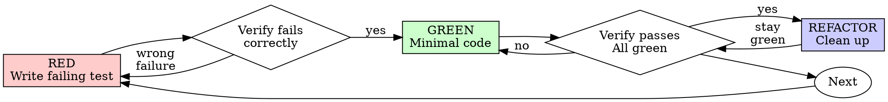

# Test-Driven Development (TDD)

## Overview

Write the test first. Watch it fail. Write minimal code to pass.

**Core principle:** If you didn't watch the test fail, you don't know if it tests the right thing.

**Violating the letter of the rules is violating the spirit of the rules.**

## When to Use

**Always:** New features, bug fixes, refactoring, behavior changes.
**Exceptions (ask your human partner):** Throwaway prototypes, generated code, configuration files.

Thinking "skip TDD just this once"? Stop. That's rationalization.

## The Iron Law

```
NO PRODUCTION CODE WITHOUT A FAILING TEST FIRST
```

Write code before the test? Delete it. Start over.

**No exceptions:** Don't keep it as "reference". Don't "adapt" it while writing tests. Don't look at it. Delete means delete. Implement fresh from tests. Period.

## Red-Green-Refactor



1. **RED** — Write one minimal failing test. Verify it fails for the right reason.
2. **GREEN** — Write simplest code to pass. No extras.
3. **REFACTOR** — Clean up. Keep tests green. Don't add behavior.
4. **Repeat** — Next failing test for next feature.

For detailed examples (good/bad) and step-by-step instructions, see [references/tdd-detailed-process.md](references/tdd-detailed-process.md).

## Red Flags — STOP and Start Over

- Code before test
- Test after implementation
- Test passes immediately
- Can't explain why test failed
- "I already manually tested it"
- "Tests after achieve the same purpose"
- "Keep as reference" or "adapt existing code"
- "Already spent X hours, deleting is wasteful"
- "TDD is dogmatic, I'm being pragmatic"
- "This is different because..."

**All of these mean: Delete code. Start over with TDD.**

For rationalization counters explaining WHY order matters, see [references/why-order-matters.md](references/why-order-matters.md).
For good tests table, verification checklist, and when-stuck guide, see [references/tdd-guidelines.md](references/tdd-guidelines.md).

## Final Rule

```
Production code -> test exists and failed first
Otherwise -> not TDD
```

No exceptions without your human partner's permission.
