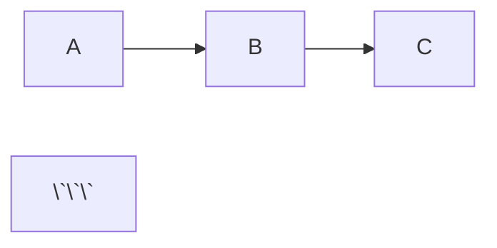

# Tech Slide

Create consistent, educational technical presentations following tech-slide patterns for structured learning materials.

## When to Use

- Technical tutorials and workshops
- Technology introductions and demos
- Educational course materials
- Conference talks with learning objectives
- Documentation presentations

## Presentation Structure

Every tech-slide presentation follows this structure:

1. **Cover** - Title, author, contact info
2. **Table of Contents** - Overview of all sections
3. **Section Dividers** - Topic transitions with context
4. **Content Slides** - Learning material
5. **Key Takeaways** - Summary of main points
6. **Thank You** - Optional closing slide

## Design Principles

- **Simplicity First** - Keep slides clean and minimal
- **Avoid Excessive Emojis** - Use sparingly, only when adding value
- **No Emojis in Section Titles** - Keep section headers professional
- **Content Over Decoration** - Focus on learning material, not visual clutter

## Quick Start

### Step 1: Choose Color Scheme

**IMPORTANT**: Select ONE primary color for your entire presentation.

**Common choices:**
- `navy` - Professional, technical (recommended)
- `emerald` - Growth, sustainability
- `violet` - Creative, innovative
- `amber` - Warm, energetic
- `pink` - Friendly, modern
- `sky` - Clear, tech-focused

**Color mode:** Light (recommended) or Dark

### Step 2: Use the Template

Copy `assets/templates/basic-tech-slide.md` and customize:

```bash
# Copy template
cp assets/templates/basic-tech-slide.md ./slides.md

# Edit content, keeping the structure
# Update title, author, sections in slides.md

# Run Slidev
npx slidev slides.md --open
```

**CRITICAL: First Slide Structure**

The first slide configuration goes directly in the frontmatter. Include `layout` and `color` in the frontmatter, then the slide content follows immediately without a slide separator.

✅ **CORRECT:**
```md
---
theme: neversink
title: My Presentation
layout: intro
color: navy
---

# First Slide Content
More content here...

<!-- Global styles and comments go after first slide content -->
<style>/* Global styles */</style>

---
layout: default
---
# Second Slide
```

❌ **WRONG:**
```md
---
theme: neversink
title: My Presentation
---

---
layout: intro
---
# First Slide  ← This creates issues
```

## Slide Patterns

### 1. Cover Slide (Full-Color)

First slide with presentation metadata. Configuration goes in frontmatter.

```md
---
theme: neversink
colorSchema: light
title: Introduction to [Your Topic]
author: Your Name
email: your.email@example.com
layout: intro
color: navy  # Your primary color
---

# Introduction to [Your Topic]
**A Comprehensive Guide**

**Your Name**  
<your.email@example.com>

:: note ::
Last updated: 2026-02-09
```

**Rules:**
- ✅ First slide layout and color in frontmatter
- ✅ Include title, author, email
- ❌ Don't use white/black background

### 2. Table of Contents (Full-Color)

Overview of all sections. Use slide separator for second slide onwards.

```md
---
layout: side-title
side: l
align: lm-lm
colorSchema: light
color: navy  # Use primary color
---

:: title ::
# Table of Contents

:: content ::

<div style="font-weight: bold">

1. Background & Motivation
2. Core Concepts
3. Implementation Guide
4. Best Practices
5. Key Takeaways

</div>
```

**Rules:**
- ✅ Use primary color (same as cover and sections)
- ✅ Keep simple and clean - avoid excessive emojis
- ✅ Number all sections consistently
- ✅ Wrap in `<div style="font-weight: bold">` for bold styling

### 3. Section Dividers (Full-Color)

Mark major topic transitions.

```md
---
layout: section
color: navy  # Same primary color for ALL sections
---

# Section: Core Concepts
<hr>

1. <span style="opacity: 0.4">Background & Motivation</span>
2. **Core Concepts**
3. <span style="opacity: 0.4">Implementation Guide</span>
4. <span style="opacity: 0.4">Best Practices</span>
5. <span style="opacity: 0.4">Key Takeaways</span>
```

**Rules:**
- ✅ Use primary color (same for ALL sections)
- ✅ Use ordered list (1. 2. 3.) for table of contents
- ✅ Show full ToC with current section bold
- ✅ Dim other sections with `<span style="opacity: 0.4">`
- ✅ Keep section titles clean - no emojis
- ❌ Don't wrap in `<div>` tags - use Markdown ordered lists
- ❌ Don't rotate colors between sections

### 4. Content Slides (White/Black Background)

Regular learning content.

```md
---
layout: default
# NO COLOR - white/black background
---

# Fundamental Principle #1

**Definition**: Clear explanation of the concept

```python
# Code example
def example():
    return "result"
\`\`\`

<v-clicks>

- **Key Point**: Important detail
- **Implication**: What this means
- **Usage**: When to apply

</v-clicks>
```

**Rules:**
- ✅ Use white/black background (NO color)
- ✅ Use primary color for accents only
- ❌ Don't use full-color backgrounds

**Two-column layout:**
```md
---
layout: two-cols-title
---

:: title ::
# Principle #2

:: left ::
### Concept
- Point 1
- Point 2

:: right ::
### Visual


### 5. Key Takeaways (White/Black Background)

Summary of main learnings.

```md
---
layout: default
---

# Key Takeaways

Main learnings from this presentation:

- **Concept A**: Core understanding gained
- **Concept B**: Key skill learned
- **Concept C**: Important principle
- **Next Steps**: Continue learning
- **Resources**: Community and docs
```

**Rules:**
- ✅ Use white/black background (NO color)
- ✅ Limit to 3-5 key points
- ✅ Make actionable and memorable

### 6. Thank You Slide (Full-Color)

Optional closing slide.

```md
---
layout: section
color: navy  # Primary color
---

<div style="text-align: center">

# Thank You!

</div>
```

## Color Guidelines

### Full-Color Slides (Use Primary Color)
- **Cover** - `layout: intro` + `color: navy`
- **Table of Contents** - `layout: side-title` + `color: navy`
- **Section Dividers** - `layout: section` + `color: navy`
- **Thank You** - `layout: section` + `color: navy`

### White/Black Background (NO Color)
- **All Content Slides** - `layout: default` or `two-cols-title` (no color)
- **Key Takeaways** - `layout: default` (no color)

### Accents (Primary Color)
Use primary color for highlights within content slides:
- Callout borders: `border-navy-500`
- Callout backgrounds: `bg-navy-50` (light) or `bg-navy-900` (dark)
- Important highlights
- Links and interactive elements

```md
# Content Slide (white background)

<div class="p-4 border-l-4 border-navy-500 bg-navy-50">
  💡 **Tip**: Primary color as accent
</div>
```

## Layout Best Practices

### two-cols-title Content Placement

**CRITICAL**: Place ALL content inside `:: left ::` and `:: right ::` sections.

❌ **WRONG**:
```md
---
layout: two-cols-title
---

:: title ::
# Title

Text outside sections causes spacing issues

:: left ::
Left

:: right ::
Right
```

✅ **CORRECT**:
```md
---
layout: two-cols-title
---

:: title ::
# Title

:: left ::
All left content

:: right ::
All right content
```

### Consistent Spacing

**Option 1: Add descriptions (Recommended for educational content)**
```md
# Title
Brief description providing context.

- List items
```

**Option 2: Global CSS (Place after first slide content)**
```md
<style>
/* Global styles - placed after first slide but applies to all slides */
.slidev-layout h1 + p,
.slidev-layout h1 + ul,
.slidev-layout h1 + ol,
.slidev-layout h1 + pre,
.slidev-layout h1 + blockquote,
.slidev-layout h1 + table,
.slidev-layout h1 + div,
.slidev-layout h1 + .v-clicks,
.slidev-layout h1 + .v-click {
  margin-top: 1.5rem !important;
}

/* Adjust list spacing if needed */
:global(ul li), :global(ol li) {
  margin-bottom: 0.5rem !important;
}
</style>
```

## Best Practices

1. **ONE primary color** - Use consistently throughout
2. **White/black for content** - Never use color backgrounds for learning slides
3. **Keep it simple** - Avoid excessive emojis and decorations
4. **Clean section titles** - No emojis in section headers
5. **3-5 major sections** - Stay focused on core objectives
6. **Section dividers every 8-12 slides** - Prevent overload
7. **Key Takeaways = 3-5 points** - Keep memorable
8. **Use ordered lists for section ToC** - Use Markdown lists (1. 2. 3.) with bold/opacity for progress
9. **Include contact info** - On cover slide
10. **Place global styles after first slide** - CSS applies to all slides when placed in `<style>` tag after cover content

## Complete Example

See [assets/templates/basic-tech-slide.md](assets/templates/basic-tech-slide.md) for a complete presentation demonstrating all patterns.