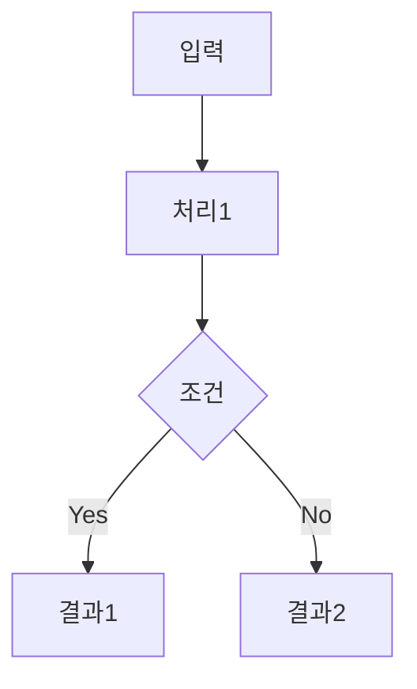

# Survey Paper Skill

arxiv 논문을 읽고 Obsidian 서베이 노트로 변환한다.

## Workflow

```
[입력: arxiv ID/URL 또는 arxiv 페이지 덤프]
      ↓
[1] 논문 목록 추출 (단일 ID면 바로 진행)
      ↓
[2] 각 논문에 대해:
    ├── 논문 다운로드 및 분석
    ├── Paper Digest 생성 (한 문단 통찰 요약)
    ├── Iterative Writing으로 세부 정리
    ├── 플로우 다이어그램 생성
    └── Obsidian 페이지 저장 → Survey 폴더
      ↓
[3] 품질 체크리스트 검증
      ↓
[4] 미충족 시 수정 후 재검증
```

## 다중 논문 처리

arxiv 페이지 덤프 시 논문 목록 추출:
- 검색 결과 페이지: 제목, arxiv ID 추출
- 저자 페이지: 저자의 논문 목록 추출
- 각 논문에 대해 위 workflow 반복 실행
- 사용자에게 처리할 논문 목록 확인 후 진행

## Phase 1: 논문 분석

arxiv MCP tool로 논문 다운로드 후 전문 읽기:
- `mcp__arxiv-mcp-server__download_paper`: 논문 다운로드
- `mcp__arxiv-mcp-server__read_paper`: 마크다운으로 읽기

핵심 추출 항목:
1. **연구 동기**: 왜 이 연구를 했는가? 기존 한계는?
2. **핵심 통찰**: 남들이 놓친 것, 이 논문만의 관점
3. **방법**: 통찰이 어떻게 방법으로 연결되는가
4. **결과**: 대안과의 구체적 비교
5. **의의**: 이 연구가 열어주는 새로운 가능성

## Phase 2: Paper Digest 생성

**구조** (한 문단, 4 요소):
1. **Context**: 문제가 뭔가?
2. **Insight**: 남들이 놓친 게 뭔가?
3. **Solution**: 통찰 → 방법의 자연스러운 연결
4. **Evidence**: 대안과의 구체적 비교

**핵심 규칙**:
- 독자가 똑똑하지만 해당 분야에 익숙하지 않다고 가정
- **전문 용어 첫 등장 시 괄호로 간단 설명** 추가 (예: "ReAct(추론-행동 반복 프레임워크)")
- 구체적 예시/비유 사용 (예: "쓰레기통 역할" >> "특정 토큰에 집중")
- 인과관계 명시적으로 보여주기
- 대안과 비교/대조 ("X는 실패한 반면 Y는 성공")
- **볼드**로 2-4개 핵심 개념 강조
- **숫자에 출처 명시** (예: "93% (Table 1)")

## Phase 3: Iterative Writing으로 세부 정리

**Fact Base 구축** (먼저):
- 논문에서 검증 가능한 사실만 추출
- 모든 숫자에 출처 명시
- 검증 안 된 주장은 사용 금지

**14 Principles 적용**:

| 카테고리 | 원칙 |
|----------|------|
| 사실성 | 모든 주장에 Fact Base 근거, 숫자는 출처 필수 (예: "93% (Table 1)") |
| 구조 | 두괄식(topic-first), 섹션 목적 명시, 의의로 마무리 |
| 이해도 | **정의 먼저** (기본 용어도 핵심 용어 정리에 포함), 비교-대조, 초심자 친화적, 논리적 흐름 |
| 형식 | 간결하게, 구체적 숫자, 산문만(bullet 금지), 추상 수준 유지 |

**용어 정의 우선 원칙**:
- Digest에서 전문 용어 첫 등장 시 괄호로 간단 설명
- 핵심 용어 정리 섹션에 논문의 기본 용어도 포함 (예: ReAct, trajectory)
- 해당 분야 초심자도 이해할 수 있도록 기초 개념부터 정의

**섹션 구조**:
1. 왜 이 연구를 하는가? (핵심 질문, 기존 한계, 핵심 통찰)
2. 방법 (Method) - 플로우 다이어그램 포함
3. 발견 (Findings) - 정량적 결과 테이블
4. 이론적 의의

## Phase 4: 플로우 다이어그램 생성

**필수 다이어그램**:
1. **메인 프레임워크**: 전체 방법론의 핵심 흐름 (mermaid 또는 ASCII)
2. **비교 다이어그램**: 기존 방법 vs 제안 방법 (필요시)

**Mermaid 형식 예시**:


**ASCII 형식 예시**:
```
┌─────────────┐     ┌─────────────┐
│   Step 1    │ ──→ │   Step 2    │
└─────────────┘     └─────────────┘
```

방법론의 핵심 흐름을 한눈에 파악할 수 있도록 시각화한다.

## Phase 5: Obsidian 페이지 생성

**파일명 규칙**: `{핵심키워드}_{연도}_{분류}.md`
- 예: `ReTRAC_2026_DeepResearch.md`

**저장 위치**: `/Users/iamseungpil/LSP/study/Study/01_Papers/Survey/[Category]/`
- 기존 카테고리: Memory, Meta-cognition, Skill_LM
- 적합한 카테고리 없으면 새로 생성

**페이지 템플릿**:

```markdown
# {논문 제목 한글 번역}

> **Digest**: {Paper Digest 한 문단}

---

## 메타데이터

| 항목 | 내용 |
|------|------|
| **제목** | {원제} |
| **저자** | {저자 목록} |
| **소속** | {기관} |
| **연도** | {연도} |
| **발표** | arXiv:{ID} |
| **링크** | [arXiv](URL), [GitHub](URL) |
| **키워드** | {핵심 키워드들} |

---

## 왜 이 연구를 하는가?

### 핵심 질문

{한 문장으로 핵심 질문}

### 기존 접근법의 한계

| 한계 | 설명 |
|------|------|
| ... | ... |

### 핵심 통찰

- {통찰 1}
- {통찰 2}

---

## 방법 (Method)

### 프레임워크 개요

{mermaid 또는 ASCII 다이어그램}

### 핵심 구성요소

{각 구성요소 설명}

---

## 발견 (Findings)

### 주요 결과

| 모델 | 메트릭1 | 메트릭2 |
|------|---------|---------|
| ... | ... | ... |

### 핵심 발견

{정량적 결과에서 도출된 핵심 발견}

---

## 이론적 의의

### {의의 1 제목}

{설명}

### {의의 2 제목}

{설명}

---

## 관련 연구

- [[관련논문1]] — 연결점 설명
- [[관련논문2]] — 연결점 설명

---

## 핵심 용어 정리

| 용어 | 정의 |
|------|------|
| ... | ... |

---

## 태그
#paper #{연도} #{분류1} #{분류2} #{핵심키워드}
```

## 카테고리 분류 기준

| 카테고리 | 키워드 |
|----------|--------|
| Memory | memory, test-time learning, context, retrieval, RAG |
| Skill_LM | reward, RL, RLHF, self-improvement, exploration, skill |
| Meta-cognition | consciousness, self-awareness, metacognition, introspection |
| (새 카테고리) | 위에 해당 안 되면 논문 주제로 새 폴더 생성 |

## 품질 체크리스트

생성 후 자체 검증 (모두 ✅ 여야 완료):

- [ ] Digest가 Context-Insight-Solution-Evidence 모두 포함하는가?
- [ ] Digest에서 전문 용어 첫 등장 시 괄호 설명이 있는가?
- [ ] 모든 숫자에 출처가 명시되어 있는가? (예: "93% (Table 1)")
- [ ] 핵심 용어 정리에 기본 용어(예: ReAct, trajectory)도 포함되어 있는가?
- [ ] 플로우 다이어그램이 방법론 핵심을 한눈에 보여주는가?
- [ ] 기존 방법과의 비교가 구체적 수치와 함께 있는가?
- [ ] 초심자가 이 노트만 보고 논문의 왜-무엇을-어떻게를 이해할 수 있는가?

**⚠️ 체크리스트 미충족 시**: 해당 부분 수정 후 재검증
