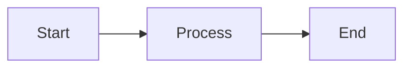
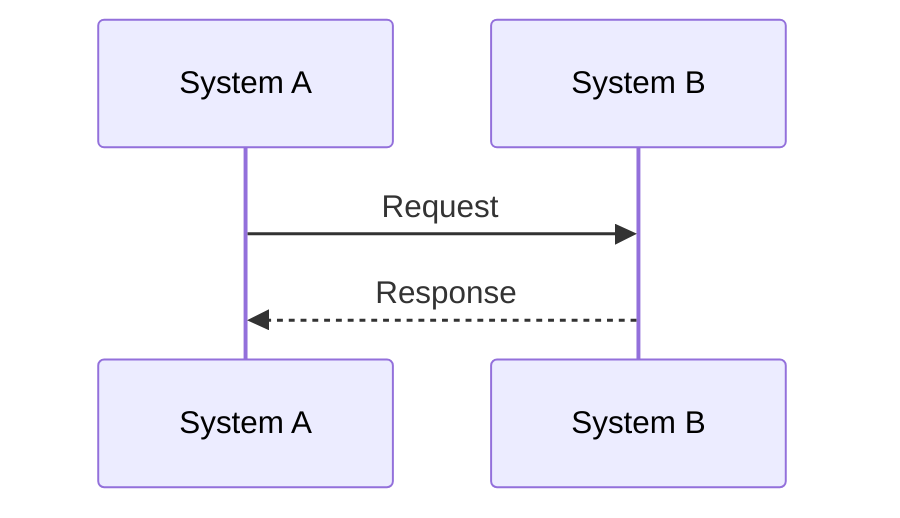
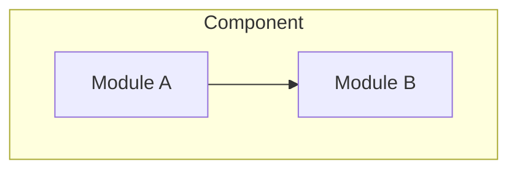

# Financial Market Master

This skill helps bank developers and Business Analysts understand financial market business knowledge in the context of banking IT systems.

## When to Use

This skill is triggered when users:
- Ask about financial market concepts (derivatives, FX, fixed income, equity)
- Need to understand trade lifecycle processes
- Want to learn about collateral management and margin calls
- Seek knowledge about regulatory requirements
- Need business context for building trading/settlement systems

## Core Workflow

### Step 1: Identify the Domain

Determine which financial domain the user is asking about:

| Domain | Reference File | Topics Covered |
|--------|----------------|----------------|
| Market Overview | `references/domain-overview.md` | Asset classes, market participants, infrastructure |
| Derivatives | `references/derivatives-basics.md` | Swaps, options, futures, forwards, pricing |
| Collateral | `references/collateral-management.md` | CSA, margin calls, VM/IM, eligible collateral |
| Trade Lifecycle | `references/trade-lifecycle.md` | Execution, confirmation, clearing, settlement |
| Regulations | `references/regulatory-framework.md` | EMIR, Dodd-Frank, MiFID II, Basel III, UMR |
| Risk Management | `references/risk-management.md` | VaR, PFE, CVA, Greeks, Stress Testing |
| Market Data | `references/market-data.md` | Curves, Surfaces, Fixings, Bootstrapping |
| Messaging | `references/messaging-standards.md` | SWIFT (MT/MX), FIX, FpML, ISO 20022 |
| Terminology | `references/glossary.md` | Financial terms A-Z |

### Step 2: Load Relevant Reference

**MANDATORY**: Based on the domain identified, you MUST read the entire reference file before generating content:

| If user asks about... | MUST READ | Do NOT Load |
|-----------------------|-----------|-------------|
| CSA, margin, collateral, VM/IM | `references/collateral-management.md` | trade-lifecycle, derivatives |
| Swaps, options, futures, forwards | `references/derivatives-basics.md` | collateral, regulatory |
| Trade confirmation, clearing, settlement | `references/trade-lifecycle.md` | market-data, messaging |
| EMIR, Dodd-Frank, UMR, Basel | `references/regulatory-framework.md` | derivatives, market-data |
| VaR, PFE, CVA, Greeks | `references/risk-management.md` | messaging, regulatory |
| Curves, Surfaces, Fixings | `references/market-data.md` | collateral, regulatory |
| SWIFT, FIX, FpML, ISO 20022 | `references/messaging-standards.md` | risk-management |
| Term definitions | `references/glossary.md` | (load in addition to domain file) |

> ⚠️ **NEVER generate content without loading the relevant reference first.**

### Step 2.5: Detect User Persona

**Adapt content depth based on the user's role** (inferred from context or explicit):

| Persona | Focus | Detection Hints |
|---------|-------|------------------|
| **Developer** | Data Models, API fields, Message schemas | mentions "database", "API", "schema" |
| **Business Analyst** | Business Rules, CSA Clauses, Workflow logic | mentions "requirement", "workflow", "stakeholder" |
| **Operations** | Daily processes, Exception handling | mentions "daily run", "exception", "dispute" |
| **General** | Conceptual understanding | no specific role indicators |

### Step 3: Context-Driven Explanation

> Always connect business purpose → concept definition → practical example → IT system impact.

### Step 4: Verify Content (Self-Correction)

**CRITICAL**: Before generating the final document, verify your mental draft against the loaded reference file:
1.  **Term Check**: Are all used terms present in the reference or standard industry glossaries?
2.  **Logic Check**: Does the explained flow match the "Money/Asset Flow" framework?
3.  **Hallucination Check**: Did I drag in a concept from a different domain (e.g., applying Equity rules to IRS)?

### Step 5: Generate Learning Document

**Always generate a comprehensive learning document** following these guidelines:

> **IMPORTANT OUTPUT RULES**:
> 1. Do NOT include instruction labels like "(REQUIRED)", "(DYNAMIC)", "(if applicable)" in output
> 2. Table of Contents must have clickable links (`#section-name`) matching actual generated sections
> 3. References section must link to REAL external URLs (official docs, not placeholders)
> 4. Replace all `[Topic]`, `[Concept A]` placeholders with actual content

**MANDATORY - READ ENTIRE FILE**: Before generating the document, you MUST load [`templates/learning-guide-template.md`](templates/learning-guide-template.md) for the complete structure and formatting rules.

**Key Requirements**:
- Always include: Overview, Core Concepts, System Implementation, Real-World Scenarios, Appendix
- Add Lifecycle section for process/flow topics
- Add Comparison sections for explaining differences (VM vs IM, Pledge vs Title Transfer)
- Add Calculation section for topics with formulas
- All References URLs must be REAL, verifiable links (no placeholders)

### Step 6: Save to Project Docs Directory (REQUIRED)

**You MUST save the generated learning document to the project's docs directory.**

**Output Path Convention**:
```
docs/fm-guide/[topic-name]-guide.md
```

**Naming Rules**:
- Use lowercase with hyphens for topic name
- Always suffix with `-guide.md`
- Group under `fm-guide` subdirectory

**Examples**:
| Topic | Output Path |
|-------|-------------|
| Margin Call | `docs/fm-guide/margin-call-guide.md` |
| CSA | `docs/fm-guide/csa-guide.md` |
| Acadia | `docs/fm-guide/acadia-guide.md` |
| Trade Lifecycle | `docs/fm-guide/trade-lifecycle-guide.md` |
| ISDA SIMM | `docs/fm-guide/isda-simm-guide.md` |

**After saving**, notify the user with the file path so they can review the generated document.

### Step 7: Ensure Document Viewer Exists (REQUIRED)

**Before finishing, you MUST check and copy the viewer.html.**

1. Check if `docs/fm-guide/viewer.html` exists in the project
2. If NOT exists, copy from skill templates:
   - Source: `fm-knowledge-guide/templates/viewer.html`
   - Destination: `docs/fm-guide/viewer.html`

**Implementation**:
```powershell
# Check and copy viewer.html if not exists
if (!(Test-Path "docs/fm-guide/viewer.html")) {
    Copy-Item "<skill-path>/templates/viewer.html" "docs/fm-guide/viewer.html"
}
```

This ensures the document viewer is always available for browsing generated guides.
The viewer dynamically lists all .md files in the same directory.

### Step 8: Launch Document Viewer (OPTIONAL)

If the user wants to view documents in browser, launch a local HTTP server:

```bash
npx -y http-server docs/fm-guide -p 0 -o /viewer.html
```

**Options**:
- `-p 0`: Use any available port
- `-o /viewer.html`: Auto-open browser to viewer

**Viewer Features**:
- Dynamically lists all `.md` files in the directory
- Left sidebar for navigation
- Right panel renders Markdown with Mermaid diagrams
- Dark theme with modern UI


## Topic Quick Reference

### Derivatives
- **Swaps**: Interest Rate Swaps (IRS), Cross Currency Swaps (CCS), FX Swaps
- **Options**: Vanilla options, exotic options, swaptions
- **Futures/Forwards**: Exchange-traded vs OTC

### Collateral Management
- **CSA**: Credit Support Annex under ISDA Master Agreement
- **Margin Types**: Variation Margin (VM), Initial Margin (IM)
- **Margin Call Flow**: Call → Agree → Pledge → Settle

### Trade Lifecycle
- **Pre-trade**: Pricing, credit check
- **Execution**: Trade capture, booking
- **Post-trade**: Confirmation, matching, clearing, settlement

### Key Dates
- **Trade Date (T)**: When the trade is executed
- **Value Date**: When the trade takes economic effect
- **Settlement Date**: When cash/securities move
- **Maturity Date**: When the trade ends

## Analyst Mindset & Research (New Frameworks)

When acting as a Bank Analyst, use these thinking frameworks before generating content:

### 1. Risk-First Thinking
> "Who carries the risk if this fails?"
- Always identify Credit Risk (counterparty default) vs Operational Risk (process failure).
- Explain mechanics in terms of risk mitigation.

### 2. The Money/Asset Flow
> "Where is the asset moving?"
- Trace the exact movement of cash/securities.
- Identify the legal ownership at each step (Pledge vs Title Transfer).

### 3. System Impact Analysis
> "What breaks if this field is wrong?"
- Connect business concepts to specific database fields or API messages (SWIFT/FIX).
- Highlight "Load Bearing" data points (e.g., Trade Date, Notional).

### 4. Research Methodology
1. **Source of Truth**: Prioritize ISDA, FpML, and Regulatory Texts (EMIR/Dodd-Frank).
2. **Cross-Check**: Verify definitions across multiple jurisdictions (US vs EU often differ).
3. **Concrete Examples**: Never leave a concept abstract; always provide a numerical or process example.

## Anti-Patterns (NEVER List)

> **CRITICAL**: The following behaviors ruin the credibility of the output.

1.  **NEVER Invent Terms**: If you don't know the industry standard term (e.g., "Variation Margin"), do not invent one (e.g., "Daily Collateral Adjustment"). Use the `glossary.md` reference.
2.  **NEVER Mix Jurisdictions**: Do not blend US rules (Dodd-Frank) with EU rules (EMIR) without explicit distinction. They have different reporting fields and timelines.
3.  **NEVER Assume Simple Interest**: In financial markets, interest is almost always compounded or calculated with specific day-count conventions (ACT/360, 30/360, ACT/365).
4.  **NEVER Ignore Settlement Lag**: Trades rarely settle instantly (T+0). Always account for T+1, T+2 settlement cycles in process flows.
5.  **NEVER Confuse VM and IM**: Variation Margin (daily MTM settlement) ≠ Initial Margin (upfront risk buffer). They have different calculation methods, timing, and regulatory drivers.
6.  **NEVER Omit Day Count Convention**: Interest calculations MUST explicitly specify the convention (ACT/360 for money markets, 30/360 for bonds, ACT/365 for some jurisdictions).
7.  **NEVER Ignore Netting Agreements**: Gross vs Net exposure under ISDA CSA can differ by 10x+. Always clarify whether values are gross or net.
8.  **NEVER Use Placeholder Links**: All URLs in References section must be real, verifiable sources. Search for actual official documentation URLs.

## Output Guidelines

- Use clear, precise financial terminology
- Include diagrams for complex flows (Mermaid format)
- Provide both business and technical perspectives
- Always cite concepts' practical implications for IT systems

## Diagram Guidelines (REQUIRED)

**Always use Mermaid format** for all diagrams to ensure consistent styling across documents.

### Supported Diagram Types

| Diagram Type | Use Case | Syntax |
|--------------|----------|--------|
| `flowchart` | Process flows, decision trees | `flowchart LR` or `flowchart TB` |
| `sequenceDiagram` | Message exchanges, API calls | `sequenceDiagram` |
| `graph` | Architecture, relationships | `graph TB` or `graph LR` |
| `stateDiagram-v2` | State machines, lifecycle | `stateDiagram-v2` |

### Example Patterns

**Process Flow**:


**Sequence Diagram**:


**Architecture Diagram**:


### Style Rules

1. **Use subgraphs** to group related components
2. **Add labels** with `<br/>` for multi-line text in nodes
3. **Keep diagrams focused** - one concept per diagram
4. **Use consistent direction** - LR for flows, TB for hierarchies
