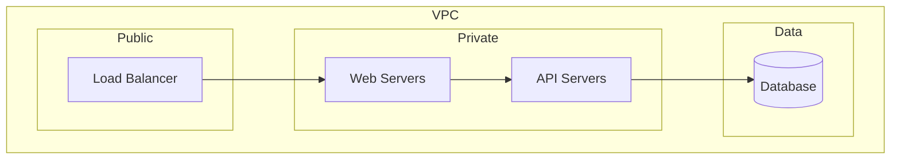

# Auto-Documentation

## Overview

Generate comprehensive documentation from infrastructure code. This skill creates READMEs, runbooks, and architecture documentation that stays in sync with actual code.

**Announce at start:** "I'm using the auto-documentation skill to generate documentation."

## Documentation Types

### 1. Module README

For Terraform modules, generate:

```markdown
# Module: [module-name]

[Brief description of what this module provisions]

## Requirements

| Name | Version |
|------|---------|
| terraform | >= X.Y.Z |
| aws | >= X.Y.Z |

## Providers

| Name | Version |
|------|---------|
| aws | X.Y.Z |

## Resources

| Name | Type |
|------|------|
| aws_instance.this | resource |
| aws_security_group.this | resource |

## Inputs

| Name | Description | Type | Default | Required |
|------|-------------|------|---------|:--------:|
| name | Name prefix for resources | `string` | n/a | yes |
| vpc_id | VPC ID | `string` | n/a | yes |

## Outputs

| Name | Description |
|------|-------------|
| instance_id | ID of the created instance |
| public_ip | Public IP address |

## Usage

```hcl
module "example" {
  source = "./modules/[module-name]"

  name   = "my-instance"
  vpc_id = "vpc-12345"
}
```

## Architecture

[Optional: Mermaid diagram of resources]

## Notes

[Any important considerations, limitations, or gotchas]
```

### 2. Environment Documentation

For environment directories:

```markdown
# Environment: [env-name]

## Overview

[Purpose and scope of this environment]

## Resource Inventory

| Category | Resource Type | Count | Key Resources |
|----------|--------------|-------|---------------|
| Compute | aws_instance | 5 | web-1, web-2, api-1 |
| Database | aws_rds_instance | 2 | primary, replica |
| Network | aws_vpc | 1 | main-vpc |

## Architecture Diagram



## Access Patterns

| Service | Port | Source | Purpose |
|---------|------|--------|---------|
| ALB | 443 | 0.0.0.0/0 | Public HTTPS |
| Web | 8080 | ALB | Internal traffic |

## Dependencies

- [External services or accounts this depends on]

## Deployment

[How to deploy changes to this environment]
```

### 3. Operational Runbook

For operations documentation:

```markdown
# Runbook: [service/component]

## Overview

[What this runbook covers]

## Common Operations

### Starting/Stopping

```bash
# Start the service
terraform apply -target=module.service

# Stop (with caution)
# See "Emergency Procedures" below
```

### Scaling

```bash
# Update instance count
terraform apply -var="instance_count=5"
```

### Health Checks

```bash
# Check instance status
aws ec2 describe-instance-status --instance-ids i-xxx

# Check application health
curl https://service.example.com/health
```

## Troubleshooting

### Problem: High CPU Usage

**Symptoms:** CPU > 80% sustained

**Investigation:**
1. Check CloudWatch metrics
2. Review application logs
3. Check for runaway processes

**Resolution:**
- Scale horizontally if traffic-related
- Restart instance if process issue

### Problem: Connection Timeouts

**Symptoms:** 504 errors at load balancer

**Investigation:**
1. Check target group health
2. Verify security group rules
3. Check application logs

**Resolution:**
- [Steps to resolve]

## Emergency Procedures

### Service Outage

1. **Assess**: Check CloudWatch alarms
2. **Communicate**: Notify stakeholders
3. **Mitigate**: [Immediate actions]
4. **Resolve**: [Fix steps]
5. **Review**: Post-incident analysis

### Rollback Procedure

```bash
# Identify previous state
git log --oneline terraform.tfstate

# Restore previous state (CAREFUL!)
# [State restoration steps]
```

## Contacts

| Role | Name | Contact |
|------|------|---------|
| On-call | [Team] | [Contact] |
| Escalation | [Manager] | [Contact] |
```

## Process

### Step 1: Analyze Code

```bash
# Find all Terraform files
find . -name "*.tf" -type f

# Extract structure
grep -h "^variable\|^output\|^resource\|^module" *.tf
```

### Step 2: Parse Components

For each file, extract:
- Variables with descriptions and defaults
- Outputs with descriptions
- Resources with types
- Module calls with sources

### Step 3: Generate Documentation

Based on directory type:
- Has `variables.tf` + `outputs.tf` → Module README
- Named `dev/`, `staging/`, `prod/` → Environment docs
- Contains operational resources → Include runbook sections

### Step 4: Review with User

**Always present generated docs for review before writing.**

Show:
- What will be created/updated
- Preview of content
- Any gaps or questions

### Step 5: Write Files

Only after user approval:
- Write new files
- Update existing files (preserve custom sections)

## Best Practices

### Keep Docs in Sync

- Regenerate after significant changes
- Use CI to detect doc drift
- Include doc generation in PR checklist

### Custom Sections

Mark custom content to preserve during regeneration:
```markdown
<!-- BEGIN CUSTOM -->
Your custom content here
<!-- END CUSTOM -->
```

### Diagrams

Use Mermaid for architecture diagrams:
- Renders in GitHub/GitLab
- Text-based, version controllable
- Easy to update

## Integration with Memory

Store documentation patterns:
- Preferred formats
- Custom sections to preserve
- Team-specific templates
