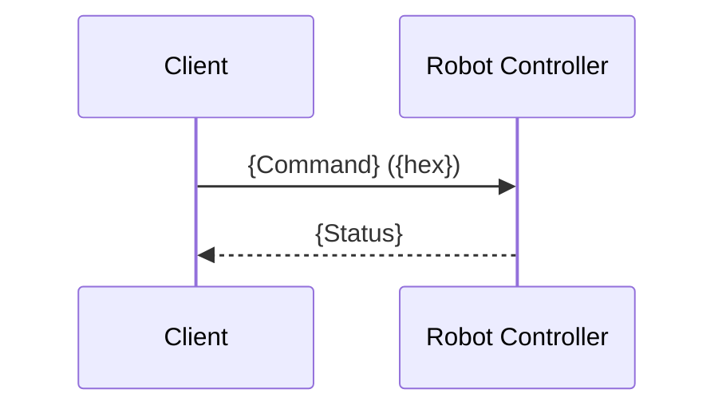

# HSES Packet Analysis

Analyze HSES protocol packets and generate a markdown report.

## When to Use

- Debugging moto-hses communication issues
- Verifying protocol implementation correctness
- Investigating unexpected robot controller responses
- Generating evidence for troubleshooting reports

## Prerequisites

- **tshark** installed (`sudo apt install tshark`)
- **hses-protocol** skill: Protocol specification for interpreting packets

## Output Directory

All captured data and reports are saved to an output directory for evidence retention:

- If a directory path is specified by the user, use that path
- If not specified, use `logs/` directory in the workspace root (create if it doesn't exist)

**Output files:**

| File | Description |
|------|-------------|
| `hses_capture_{timestamp}.pcap` | Raw packet capture (binary) |
| `hses_export_{timestamp}.txt` | Exported packet data (text) |
| `hses_report_{timestamp}.md` | Analysis report (markdown) |

Timestamp format: `YYYYMMDD_HHMMSS`

## Workflow

### Step 1: Prepare Output Directory

Create the output directory if it doesn't exist:

```bash
mkdir -p <output_dir>
```

### Step 2: Start Capture (Background)

Start packet capture before running the application. Use `-i any` to capture on all interfaces (avoids needing to know the specific network interface):

```bash
tshark -i any -w <output_dir>/hses_capture_<timestamp>.pcap -f "udp port 10040" &
sleep 2  # Wait for tshark to initialize
```

### Step 3: Run Application

Run the application (e.g., `cargo test` or `cargo run`):

```bash
cargo test --test <test_name>
# or
cargo run -- <args>
```

### Step 4: Stop Capture

After the application completes, stop the capture:

```bash
pkill -f "tshark.*hses_capture"
```

### Step 5: Export

Export captured packets to text format:

```bash
tshark -r <output_dir>/hses_capture_<timestamp>.pcap -T fields -e frame.number -e frame.time_relative -e data > <output_dir>/hses_export_<timestamp>.txt
```

### Step 6: Analyze

Read the export file and generate an analysis report following the output template below. Save the report to `<output_dir>/hses_report_<timestamp>.md`.

**Important:** Always generate the report in English.

## Input

Exported packet file (from Step 5).

**Format** (1 packet per line, tab-separated):
```
{packet_number}	{time_relative}	{hex_data}
```

Example:
```
1	0.000000	5945524320000000030100010000000039393939393939397200010000010000
2	0.000105	59455243200008000301010100000080393939393939393981000200000000004c00000040000000
```

## Output

Generate a markdown report with the following sections:

### 1. Summary

| Metric | Value |
|--------|-------|
| Total Packets | {count} |
| Requests | {request_count} |
| Responses | {response_count} |
| Errors | {error_count} |
| Duration | {duration} sec |

### 2. Protocol Validation

Validate against **hses-protocol** specification:

| Check | Description |
|-------|-------------|
| Magic bytes | All packets start with "YERC" (0x59455243) |
| Header size | All headers are 32 bytes (0x0020) |
| Reserved (byte 8) | Value is 0x03 |
| Reserved (bytes 16-23) | Value is "99999999" |
| Division | 0x01 (Robot) or 0x02 (File) |
| ACK field | 0x00 (Request) or 0x01 (Response) |
| Block number | Request=0, Response=0x80000000 (single) |
| Request/Response pairs | Each request has matching response |
| Service code match | Response service = Request service + 0x80 |
| Known command IDs | Command IDs are valid per hses-protocol |

Report validation errors if any check fails.

### 3. Communication Sequence

Mermaid diagram showing request/response flow:



Detail table:

| # | Time | Dir | Command | Instance | Status | Description |
|---|------|-----|---------|----------|--------|-------------|

### 4. Protocol Errors (if any)

| # | Time | Command | Error Code | Meaning |
|---|------|---------|------------|---------|

Refer to **hses-protocol** skill for error code definitions.

### 5. Packet Details

For each packet, show:
- Time
- Type (Request/Response)
- Command ID and name (per hses-protocol)
- Key fields
- Raw hex data
