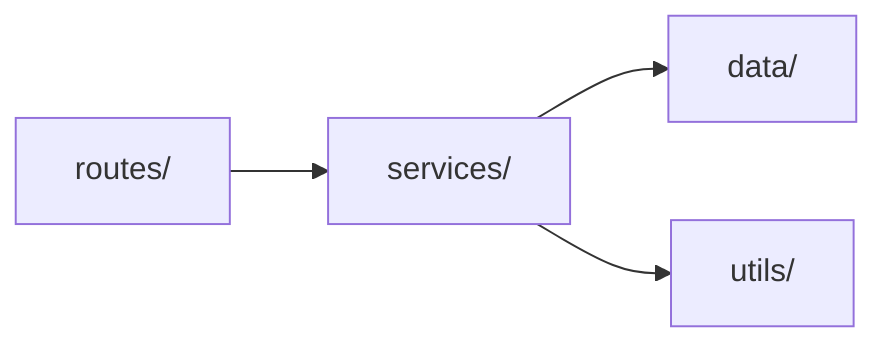
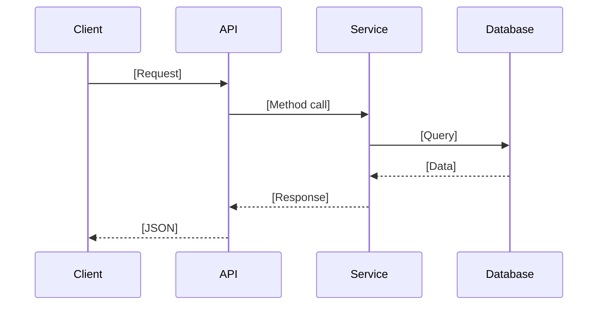

# Project Onboarding

Help developers quickly build mental models of unfamiliar projects through systematic analysis and staged delivery.

## Interactive Workflow

This skill uses a phased approach with user checkpoints to manage context efficiently and focus analysis where needed.

### Phase 0: Context Collection

Before starting analysis, gather essential context. If the user provides only a project path, auto-detect the rest:

```
I'll help you understand this project. First, confirm a few details:

1. **Project path**: [confirm or ask]
2. **Your goal**:
   - Quick onboarding (run locally within 1 hour)
   - Fix specific issue
   - Add new feature
   - Understand for maintenance
   - Other: _____
3. **Time budget**: 1 hour / 1 day / 1 week / custom
4. **Known tech stack** (optional, auto-detect if empty): _____

If you just want to start quickly, I'll auto-detect everything from the code.
```

Skip questions for which answers are already clear from context.

### Phase 1: Project Health Check (5-10 minutes)

Execute rapid diagnostic scan to identify project type, quality signals, and immediate concerns.

#### Automated Detection Steps

1. **Identify project type**
```bash
# Check for ecosystem markers
ls -la | grep -E "package.json|pom.xml|go.mod|Cargo.toml|requirements.txt|Gemfile|composer.json"
```

2. **Health indicators**
```bash
# Check documentation
ls README* 2>/dev/null && echo "✅ README exists" || echo "❌ No README"

# Check git history activity
git log --oneline --since="6 months ago" | wc -l

# Find configuration examples
ls .env.example .env.sample 2>/dev/null || echo "⚠️ No config examples"

# Test coverage indicators
find . -type d -name "__tests__" -o -name "test" -o -name "tests" 2>/dev/null
```

3. **Code quality signals** (especially for poorly maintained code)
```bash
# Large files (complexity indicator)
find . -type f \( -name "*.js" -o -name "*.ts" -o -name "*.py" -o -name "*.java" \) \
  -exec wc -l {} \; | sort -rn | head -10

# TODO/FIXME density
find . -type f \( -name "*.js" -o -name "*.ts" -o -name "*.py" \) \
  -exec grep -Hn "TODO\|FIXME\|HACK\|XXX\|BUG" {} \; | head -20

# Commented-out code (smell for technical debt)
find . -name "*.js" | xargs grep -c "^[[:space:]]*\/\/" | \
  awk -F: '$2>50 {print $1 ": " $2 " lines"}' | head -5

# Dead code indicators
find . \( -name "*backup*" -o -name "*old*" -o -name "*temp*" -o -name "*.bak" \) 2>/dev/null
```

4. **Find entry points**
```bash
# Server/service entry points
grep -r "listen\|createServer\|app.run\|main()" --include="*.ts" --include="*.js" \
  --include="*.py" --include="*.go" | head -5

# Build/start scripts
cat package.json | grep -A 3 '"scripts"' 2>/dev/null
```

#### Output Format: Health Report

```markdown
# Project Health Check: [PROJECT_NAME]

## Basic Info
- **Type**: [monolith/microservice/library/CLI/frontend app/monorepo]
- **Primary language**: [Language] ([version if detectable])
- **Package manager**: [npm/yarn/pnpm/pip/cargo/...]
- **Build tool**: [webpack/vite/gradle/...]

## Health Score: [X/10]

### ✅ Strengths
- [List positive findings]

### ⚠️ Concerns
- [List medium-priority issues]

### ❌ Critical Issues
- [List serious problems]

### 🔍 Code Quality Indicators
- **TODO/FIXME count**: X occurrences ([top 5 locations with file:line])
- **Large files (>1000 lines)**: [count] files ([top 3: filename:lines])
- **Commented code density**: [high/medium/low]
- **Dead code artifacts**: [list temp/backup files if found]
- **Naming inconsistencies**: [examples if detected]

## One-Line Summary
[Inferred purpose from README and code structure]

## Core Value (3 points)
1. [What problem it solves]
2. [Key user/stakeholder]
3. [Primary capability]

## Entry Points
- **Main file**: `[path:line]`
- **Start command**: `[command]` (from `[source]`)
- **Routes/API**: `[path]` (if applicable)

---
**Next steps**: Choose what to explore:
1. 📄 Quick start guide (run locally in 15 min)
2. 🏗️ Architecture & code map (deep dive)
3. 📊 Specific analysis (pick dimensions)

[WAIT FOR USER CHOICE]
```

### Phase 2: Quick Start Guide

Provide when user wants to run the project immediately or chooses option 1.

```markdown
# Quick Start Guide: [PROJECT_NAME]

## Prerequisites
```bash
# Version check commands
[language] --version  # Need: [version requirement]
[package_manager] --version

# Installation if missing:
[specific installation commands or links]
```

## Startup Sequence (Target: 15 minutes)

### Step 1: Install dependencies
```bash
cd [project_path]
[install_command]  # e.g., npm install, pip install -r requirements.txt

# Expected output:
# [sample successful output]

# Common failures:
# ❌ "EACCES permission denied" → Solution: [specific fix]
# ❌ "Cannot find module X" → Solution: [specific fix]
```

*Evidence*: 
- Dependency file: `[path]`
- Lock file: `[path]` (checksum: [hash])

### Step 2: Configure environment
```bash
# If .env.example exists:
cp .env.example .env

# Otherwise create manually:
cat > .env << 'EOF'
[required variables with defaults]
EOF
```

*Evidence*:
- Variables loaded at: `[file:line]`
- Required vars: [list from code analysis]
- Optional vars: [list with defaults]

### Step 3: Initialize data (if needed)
```bash
[migration/seed commands if applicable]

# Verify:
[verification command]
```

### Step 4: Start service
```bash
[start command]

# Success indicators:
# [specific log messages to look for]
# Server ready at: http://localhost:[port]

# Verification:
curl [health_check_endpoint] || [alternative verification]
# Expected: [response]
```

*Evidence*:
- Port config: `[file:line]`
- Startup logs: `[file:line where logging configured]`

## Test Execution
```bash
[test command]

# Expected:
# [sample passing output]

# Common failures:
1. **Database not ready**
   Error: `[specific error text]`
   Fix: `[specific command]` ([source: file:line])

2. **Port conflict**
   Error: `EADDRINUSE`
   Fix: `lsof -i :[port] | grep LISTEN | awk '{print $2}' | xargs kill`
```

## Verification Checklist
- [ ] Service starts without errors
- [ ] Health endpoint responds (or equivalent test)
- [ ] Basic test suite passes
- [ ] Logs show expected initialization
- [ ] Can access UI/API (if applicable)

## Command Reference
| Action | Command | Source |
|--------|---------|--------|
| Dev mode | `[command]` | `[package.json:line or equivalent]` |
| Build | `[command]` | `[source]` |
| Test | `[command]` | `[source]` |
| Lint | `[command]` | `[source]` |

---
**What's next?**
- Understand architecture → Ask for "architecture analysis"
- Trace specific request → Tell me the endpoint/feature
- Start coding → Ask for "safe contribution points"

[WAIT FOR USER CHOICE]
```

### Phase 3: Deep Analysis (On Demand)

Only provide when user explicitly requests. Offer menu of analysis dimensions:

```markdown
Select analysis areas (can choose multiple):

1. 🏗️ **Architecture view** - Modules, dependencies, data flow
2. 🗺️ **Code map** - Directory structure, key files, coupling
3. 📊 **Business logic** - End-to-end flow tracing
4. 💾 **Data model** - Database, schemas, relationships
5. ⚙️ **Configuration** - Environment vars, secrets management
6. 📈 **Observability** - Logging, debugging, monitoring
7. 🧪 **Testing** - Test structure, coverage, strategies
8. 🚀 **CI/CD** - Build pipeline, deployment process
9. 🔒 **Security** - Auth, permissions, vulnerabilities

Input: [numbers] or "describe your need"
```

#### Architecture View Template

When user selects architecture analysis:

```markdown
## Architecture Analysis

### System Topology
```mermaid
graph TB
    Client[Client/Browser]
    API[API Server<br/>[main entry file]]
    DB[(Database)]
    Cache[(Cache)]
    
    Client -->|HTTP| API
    API -->|Query| DB
    API -->|Get/Set| Cache
```

*Evidence*:
- API entry: `[file:line]`
- DB connection: `[file:line]`
- Cache client: `[file:line]`

### Module Dependencies


*Evidence*: Import analysis from `[grep command used]`

### Key Modules

| Module | Purpose | Key Files | Risks |
|--------|---------|-----------|-------|
| `[path]` | [responsibility] | `[file]` ([N] lines) | [⚠️ issues if any] |

### External Dependencies

| Type | Service | Config Location | Local Dev Option |
|------|---------|-----------------|------------------|
| Database | [name] | `[env var]` at `[file:line]` | Docker Compose / SQLite |
| Cache | [name] | `[env var]` at `[file:line]` | Redis local / in-memory |

### Critical Data Flow: [Example Use Case]


*Evidence*:
- Route handler: `[file:line-range]`
- Service method: `[file:line-range]`
- Database query: `[file:line-range]`

### 🚨 Architecture Risks

1. **[Risk title]**
   - Location: `[file:line]`
   - Impact: [description]
   - Evidence: [code snippet or pattern]
   - Mitigation: [suggestion]

[Continue with other risk areas]
```

### Phase 4: Action Plans

Provide when user has completed orientation and wants concrete next steps:

```markdown
## Action Plan: [TIME_BUDGET]

### 1-Hour Plan: Run & Understand
**Goal**: Service running + core flow traced

Tasks:
- [ ] Complete environment setup
- [ ] Start service and verify
- [ ] Execute one complete request: [specific example]
  ```bash
  [curl or API call]
  ```
- [ ] Review logs for this request
  ```bash
  [log location or command]
  ```

**Verification**:
```bash
[specific verification steps with expected output]
```

### 1-Day Plan: Navigate & Modify
**Goal**: Locate modules + make safe change

**Morning**: Code navigation drill
1. Pick API endpoint: `[example endpoint]`
2. Trace from route → service → data
   - Route: `[file:line]`
   - Service: `[file:line]`
   - Query: `[file:line]`
3. Practice change: Add field to response
   - Location: `[file:function]`
   - Change: [specific modification]
   - Test: [verification]

**Afternoon**: Fix simple bug
Priority targets (low risk):
1. Documentation typos
2. Log message improvements  
3. Missing input validation on `[specific field]`

Find bugs:
```bash
grep -rn "TODO\|FIXME" [source_dir]/
git log --grep="bug\|fix" --oneline -20
```

### 1-Week Plan: Own Feature
**Goal**: Complete small feature independently

**Knowledge gaps to fill**:
1. [Domain concept] - Read `[doc/file]`
2. [Tech stack detail] - Review `[framework docs section]`
3. [Test patterns] - Study `[test_file]`

**Reading order**:
```
[entry_file] (15 min) 
  ↓
[routes_file] (30 min - map all endpoints)
  ↓
[services_dir] (1-2 hours - core logic)
  ↓
[data_dir] (30 min - understand persistence)
  ↓
[Choose one module to deep dive] (2 hours)
```

**Recommended first issues**:
- 🟢 Add tests for `[uncovered module]`
- 🟢 Improve error messages in `[file]`
- 🟡 Implement `[simple CRUD endpoint]`
- 🟡 Add caching to `[specific query]`

## Contribution Safety Guide

### Code Style (Inferred)
*Analysis*:
```bash
# File naming
find [src] -name "*.ts" | head -20
# Result: [camelCase / kebab-case / mixed]

# Function naming  
grep -rh "^export function\|^export const" [src]/ | head -10
# Pattern: [observed pattern]
```

**Conventions** (with evidence):
- Files: [naming style] (see `[example files]`)
- Functions: [naming style] (see `[file:line examples]`)
- Classes: [naming style]

### Directory Organization
```
[project_root]/
├── [dir]/ - [inferred purpose]
├── [dir]/ - [inferred purpose]
└── [dir]/ - [inferred purpose]
```

**Where to add new code**:
- New API: `[directory/file pattern]`
- New logic: `[directory/file pattern]`
- New data model: `[directory/file pattern]`

### Commit Strategy
*Git history analysis*:
```bash
git log --oneline --format="%s" -50 | head -10
```

Pattern detected: [conventional commits / freeform / other]

Recommendation:
```
[type]([scope]): [subject]

Examples:
- feat(api): add user profile endpoint
- fix(auth): handle expired tokens correctly
```

### Common Pitfalls

| Issue | Symptom | Cause | Solution |
|-------|---------|-------|----------|
| [problem] | [error message] | [root cause at file:line] | [fix command] |

### Safe Contribution Points (3 examples)

#### 1. Add logging (lowest risk)
**Location**: `[file:function]`
**Change**:
```[language]
// Add at line [N]:
console.log('[Module] Action:', [data]);
```
**Verify**: [how to see log]
**Rollback**: Delete line

#### 2. Adjust config (low risk)
**Location**: `[config_file:line]`
**Change**: `[parameter]` from `[old]` to `[new]`
**Verify**: [test command]
**Rollback**: Revert value

#### 3. Add validation (medium risk)
**Location**: `[file:function]`  
**Change**:
```[language]
if (![validation]) {
  throw new Error('[message]');
}
```
**Verify**: [test with invalid input]
**Rollback**: Remove check

---

## Follow-Up Questions (If Needed)

Ask ONLY if cannot infer from codebase (max 6):

1. **Database migrations**: Found `[migration_dir]` but unclear if manual SQL or ORM-driven. How are migrations run?

2. **Test data**: How is test database populated? (no seed scripts found)

3. **Deployment**: Is production containerized? (no Dockerfile found, but [evidence of X])

4. **Branch policy**: PR review required? (no `.github/CODEOWNERS` or branch protection visible)

5. **Secrets management**: Production secrets via `[vault/AWS/other]`? (.env not in .gitignore - risky)

6. **Code ownership**: Any modules with designated owners?
```

## Tool Usage Guidelines

### Efficient Scanning

```bash
# Project type identification
ls -la | grep -E "package.json|pom.xml|go.mod|Cargo.toml|requirements.txt"

# Entry point discovery  
grep -r "listen\|createServer\|app.run\|if __name__" \
  --include="*.ts" --include="*.js" --include="*.py"

# Configuration files
find . -maxdepth 2 \( -name "*.config.*" -o -name ".*rc" -o -name ".env*" \)

# Code quality signals
find . -name "*.ts" -exec wc -l {} \; | sort -rn | head -10  # Large files
grep -rn "console.log" --include="*.ts" | wc -l  # Debug statements
grep -rn "http://\|https://" --include="*.ts" | grep -v "^//"  # Hardcoded URLs
```

### File Reading Priority

**Must read (Phase 1)**:
1. README.md
2. package.json (or equivalent manifest)
3. .env.example (if exists)
4. Main entry file

**Important (Phase 2)**:
1. Route definitions
2. Core service/controller files
3. Config initialization

**On-demand (Phase 3)**:
1. Specific modules as needed
2. Test files for patterns
3. Migration scripts

### Handling Large Files

For files >500 lines:
```python
# Read strategically
view(path="large_file.ts", view_range=[1, 50])    # Start
view(path="large_file.ts", view_range=[-50, -1])  # End
# Then middle sections as needed
```

## Evidence Citation Format

Every conclusion must cite source:

- **File content**: `path/to/file.ts:45-67` or `path:line`
- **Configuration**: `package.json → scripts.start → "node server.js"`
- **Command output**: Result of `[bash command]`
- **Inference**: "Based on [pattern/structure/naming], likely [conclusion]"

Flag uncertainty: **[UNCERTAIN]** [reason] - Verify via `[command/file]`

## Output Principles

1. **Progressive disclosure**: Deliver in phases, wait for user choice
2. **Evidence-based**: All claims cite file:line or command output
3. **Action-oriented**: Every section ends with "What's next?"
4. **Risk-aware**: Highlight quality issues without judgment
5. **Beginner-friendly**: Assume smart but unfamiliar reader

## References

See `references/` for:
- `analysis-patterns.md` - Templates for different project types
- `quality-signals.md` - Code smell detection patterns
- `recovery-strategies.md` - How to handle missing docs/tests
