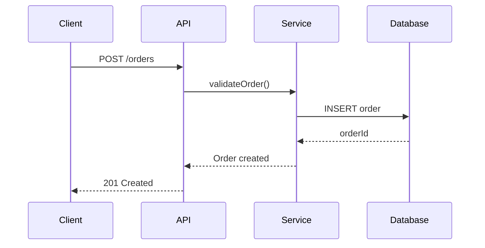

## Critical Patterns

### API-First Approach (REQUIRED)

```
Design the API (OpenAPI Spec) BEFORE writing code or user stories.
Protocol: Assume HTTP RESTful by default unless specified (gRPC, EDA).
```

### User Story Format (REQUIRED)

```
As [user role],
I want [specific objective],
So that [benefit and/or value].
```

### Acceptance Criteria (REQUIRED)

```gherkin
Scenario: [Scenario Name]
  Given [pre-condition]
  When [action]
  Then [expected result]
```

---

## Decision Tree

```
Need API design?           → Start with OpenAPI spec
Need user story?           → Use As/I want/So that format
Need test cases?           → Use Gherkin Given/When/Then
Need flow visualization?   → Use Mermaid sequenceDiagram
```

---

## Code Examples

### OpenAPI Endpoint

```yaml
paths:
  /users/{userId}:
    get:
      summary: Get user by ID
      operationId: getUserById
      parameters:
        - name: userId
          in: path
          required: true
          schema:
            type: string
            format: uuid
      responses:
        '200':
          description: User found
          content:
            application/json:
              schema:
                $ref: '#/components/schemas/User'
        '404':
          description: User not found
```

### Sequence Diagram



### User Story Example

```
As an authenticated user,
I want to view my order history,
So that I can track my past purchases.

Acceptance Criteria:
Scenario: View order history
  Given I am logged in
  When I navigate to /orders
  Then I see a list of my orders sorted by date
  And each order shows status and total amount
```

---

## Success Metrics

- **Business**: ROI, user adoption
- **Performance**: Latency, throughput
- **Infrastructure**: Error rates, uptime
- **SLIs/SLOs**: Specific service level objectives
