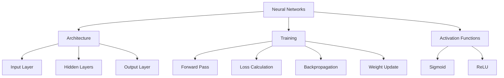
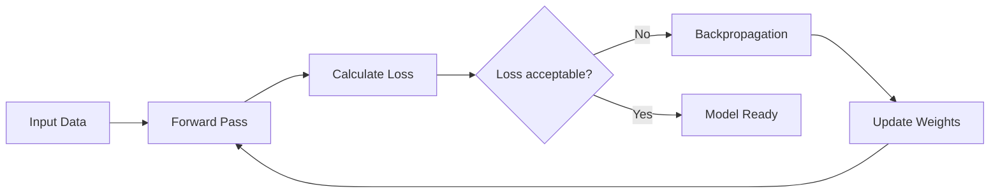
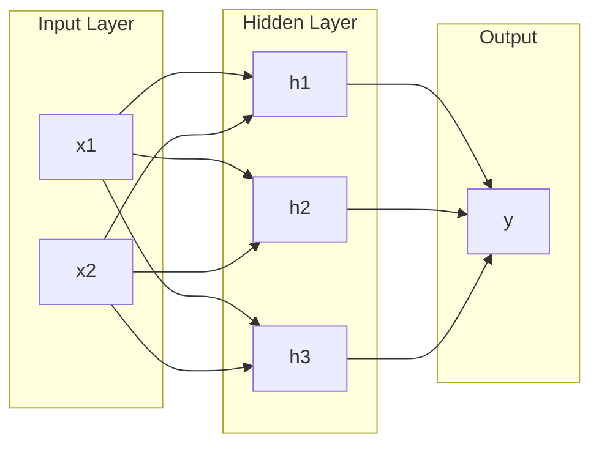
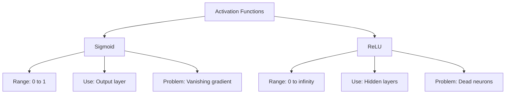
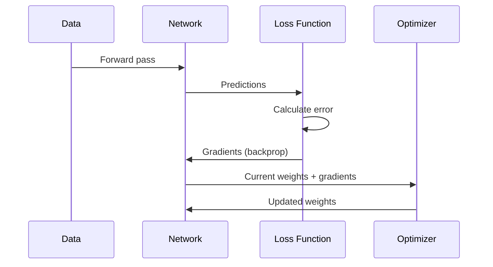
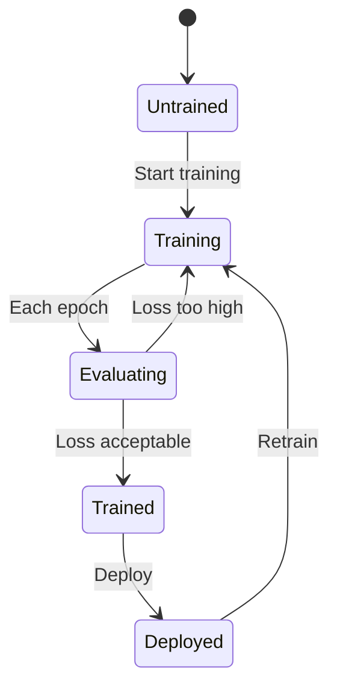
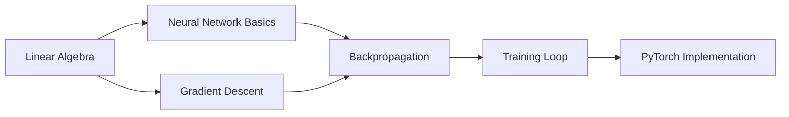
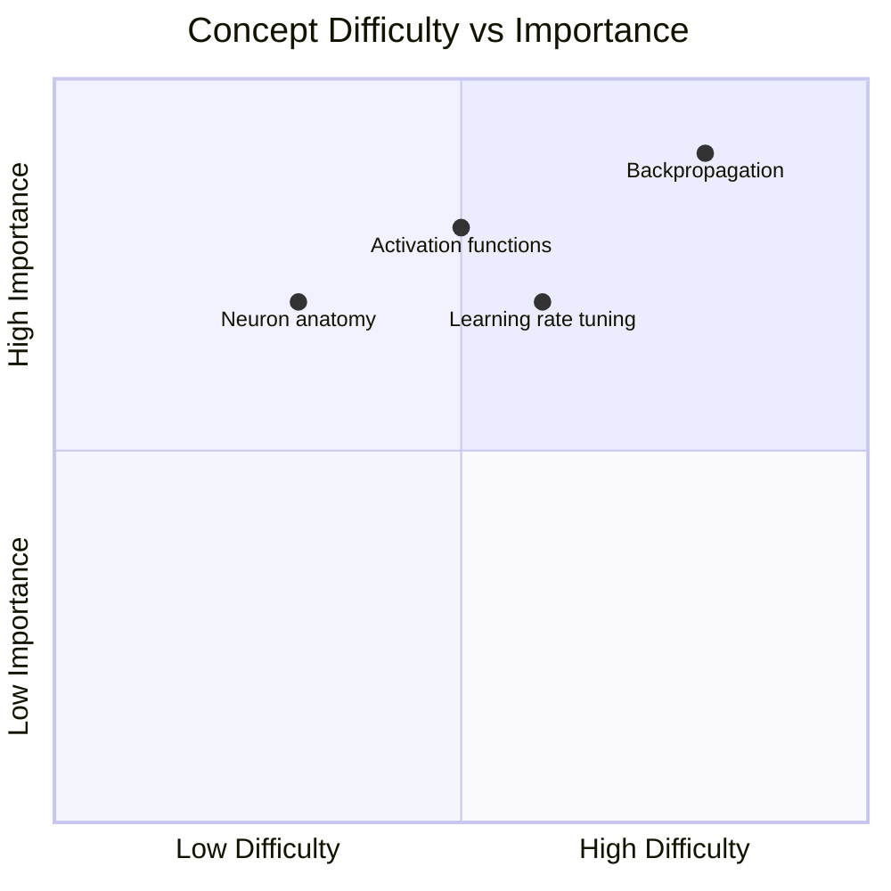
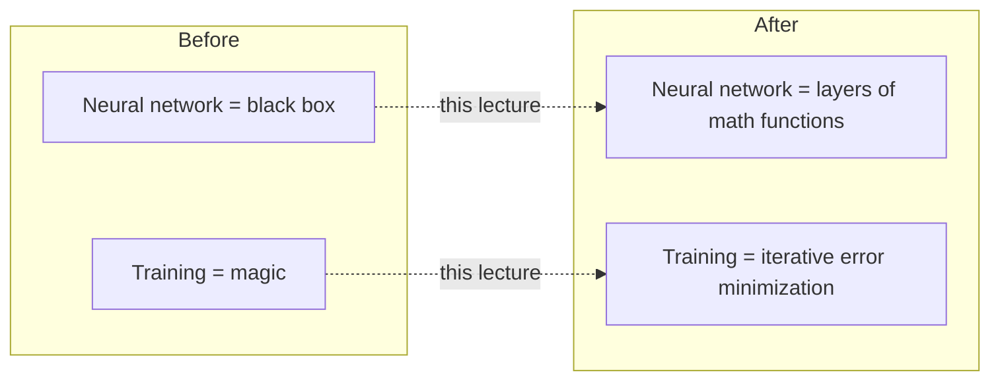

# Concept Cartographer - Visual Knowledge Mapper

Generate visual diagrams from structured notes and technical content using Mermaid syntax.

## Core Purpose

Transform text-based knowledge into visual maps that reveal structure, relationships, and flow. Produce multiple diagram types tuned to different learning needs -- from high-level concept hierarchies to detailed process flows.

## Diagram Types

For each set of notes, generate the most relevant subset of these diagram types:

### 1. Concept Hierarchy Map
Shows how topics relate parent-child.



**Use when:** Content has clear topic hierarchy (most lectures).

### 2. Process Flowchart
Shows step-by-step procedures and decision points.



**Use when:** Content describes processes, algorithms, or workflows.

### 3. Architecture Diagram
Shows system components and data flow.



**Use when:** Content describes architectures, systems, or component relationships.

### 4. Comparison Diagram
Shows differences between concepts side by side.



**Use when:** Content compares alternatives, trade-offs, or choices.

### 5. Timeline / Sequence Diagram
Shows order of events or data flow over time.



**Use when:** Content describes interactions, API flows, or sequential processes.

### 6. State Diagram
Shows states and transitions.



**Use when:** Content describes lifecycle, states, or mode changes.

## Domain-Specific Focus

| Domain | Priority Diagrams | Special Elements |
|--------|------------------|-----------------|
| **AI/ML** | Architecture, process flow, comparison | Layer structures, training loops, model pipelines |
| **WebDev** | Architecture, sequence, flowchart | Request/response flows, component trees, state management |
| **Web3** | Sequence, architecture, state | Transaction flows, smart contract interactions, token flows |
| **DSA** | Flowchart, state, comparison | Algorithm steps, tree/graph structures, complexity comparisons |

## Output Format

For each set of notes, produce a markdown document with:

```markdown
# Visual Concept Maps: [Topic]

## Overview Map
[Concept hierarchy - always include this one]

## [Diagram Type 2 title]
[Most relevant additional diagram]

## [Diagram Type 3 title]
[Second most relevant]

## Key Relationships Summary
- [Concept A] depends on [Concept B] because...
- [Concept C] is an alternative to [Concept D] when...
- [Process X] feeds into [Process Y] via...
```

## Rules

1. **Every diagram must be valid Mermaid syntax** - test mentally before output
2. **Always include concept hierarchy** - this is the minimum output
3. **Pick 2-4 diagram types** per set of notes based on content
4. **Label nodes clearly** - use short but descriptive text
5. **Don't overcrowd** - split large diagrams into focused sub-diagrams (max ~15 nodes per diagram)
6. **Use subgraphs** for grouping related concepts
7. **Add a text summary** of key relationships below diagrams
8. **Match the domain** - use domain-appropriate terminology and diagram choices

## Topic Inventory Verification

If a Topic Inventory was provided from Stage 1, verify that every concept from the inventory appears in at least one diagram. Report:

```markdown
## Concept Coverage
- Concepts in diagrams: [N] / [N] from inventory
- Concepts not diagrammed: [list] (with reason: "too granular" or "no visual relationship")
```

## Enhanced Diagram Types (Best-in-Class)

### 7. Learning Path / Prerequisite Map
Shows what to learn in what order.



**Use when:** Content has concepts that build on each other. Always generate this for educational content.

### 8. Difficulty Landscape
Visual guide to concept difficulty and importance.



**Use when:** Content has concepts of varying difficulty -- helps prioritize study time.

### 9. Before/After Mental Model
Shows how understanding should shift.



**Use when:** Lecture fundamentally changes how a concept should be understood.

## Pipeline Position

This skill is **Stage 3** in the lecture processing pipeline:
1. **transcribe-refiner** → clean transcript + Topic Inventory
2. **lecture-alchemist** → structured study notes
3. **concept-cartographer** (this) → visual diagrams (verifies against inventory)
4. **obsidian-markdown** → Obsidian vault formatting
