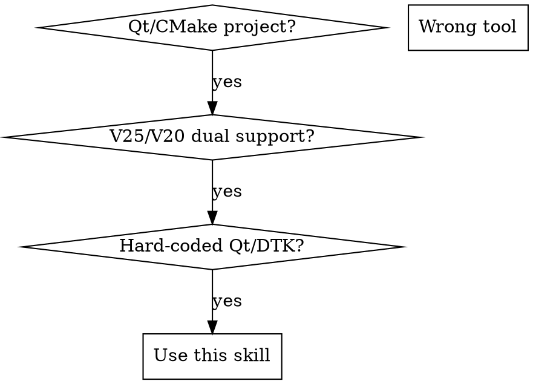

# qt-compatibility-build

## Overview

Unifies CMake configuration for deepin V25/V20 dual-version support by automatically detecting Qt5/Qt6 and dynamically mapping DTK versions, eliminating hard-coded version references throughout the build system.

## File Convention

| File | Deepin Version | Qt Version |
|------|---------------|------------|
| `debian/control` | V25 | Qt6 |
| `debian/control.1` | V20 | Qt5 |

**Why**: `control` (no suffix) = latest version (V25), `control.1` (with suffix) = previous version (V20).

## When to Use



**Use when:**
- CMakeLists.txt has hard-coded `Qt5::` or `Qt6::` in `target_link_libraries`
- CMakeLists.txt has hard-coded `Dtk::` or `Dtk6::` in `find_package` or linking
- Projects need both V25 (Qt6) and V20 (Qt5) builds from same code
- Need dynamic library linking based on detected Qt version
- DTK dependencies need to map automatically to installed Qt version

**Do NOT use when:**
- Projects without CMake build system
- Projects without Qt dependencies
- Single version support only (V25-only or V20-only)

## Quick Reference

| Task | Command/Pattern |
|------|-----------------|
| Auto-detect Qt | `find_package(QT NAMES Qt6 Qt5 REQUIRED COMPONENTS Core)` |
| Map DTK to Qt | `if (QT_VERSION_MAJOR MATCHES 6) set(DTK_VERSION_MAJOR 6)` |
| Dynamic Qt find | `find_package(Qt${QT_VERSION_MAJOR} COMPONENTS ${QT} REQUIRED)` |
| Dynamic DTK find | `find_package(Dtk${DTK_VERSION_MAJOR}Widget REQUIRED)` |
| Dynamic Qt linking | `Qt${QT_VERSION_MAJOR}::Core` |
| Dynamic DTK linking | `Dtk${DTK_VERSION_MAJOR}::Core` |
| V25 build | `cmake -B build -DQT_DIR=/usr/lib/x86_64-linux-gnu/cmake/Qt6` |
| V20 build | `cmake -B build5 -DQT_DIR=/usr/lib/x86_64-linux-gnu/cmake/Qt5` |

**Note**: `-DQT_DIR` is optional for local build convenience. CMake auto-detects if not specified.

## Implementation

### Step 1: Add Qt Detection (CMakeLists.txt top)

```cmake
# Auto-detect Qt version (tries Qt6 first, falls back to Qt5)
find_package(QT NAMES Qt6 Qt5 REQUIRED COMPONENTS Core)
message(STATUS "Found Qt version: ${QT_VERSION_MAJOR}")

# Map to DTK version (Qt6→DTK6, Qt5→DTK5)
if (QT_VERSION_MAJOR MATCHES 6)
    set(DTK_VERSION_MAJOR 6)
else()
    set(DTK_VERSION_MAJOR "")
endif()
message(STATUS "Build with DTK: ${DTK_VERSION_MAJOR}")
```

### Step 2: Update All find_package Calls

**Before (hard-coded):**
```cmake
find_package(Qt6 COMPONENTS Core Gui Widgets Network REQUIRED)
find_package(DtkWidget REQUIRED)
```

**After (dynamic):**
```cmake
set(QT Core Gui Widgets Network DBus Sql Svg Test WebChannel WebSockets)
find_package(Qt${QT_VERSION_MAJOR} COMPONENTS ${QT} REQUIRED)

find_package(Dtk${DTK_VERSION_MAJOR}Widget REQUIRED)
find_package(Dtk${DTK_VERSION_MAJOR}Core REQUIRED)
find_package(Dtk${DTK_VERSION_MAJOR}Gui REQUIRED)
```

### Step 3: Update All target_link_libraries

**Before (hard-coded):**
```cmake
target_link_libraries(mylib
    Dtk::Core
    Dtk::Gui
    Qt6::Network
)
```

**After (dynamic):**
```cmake
target_link_libraries(mylib
    Dtk${DTK_VERSION_MAJOR}::Core
    Dtk${DTK_VERSION_MAJOR}::Gui
    Qt${QT_VERSION_MAJOR}::Network
)
```

**Replacement pattern:**
- `Qt5::` → `Qt${QT_VERSION_MAJOR}::`
- `Qt6::` → `Qt${QT_VERSION_MAJOR}::`
- `Dtk::` → `Dtk${DTK_VERSION_MAJOR}::`
- `Dtk6::` → `Dtk${DTK_VERSION_MAJOR}::`

### Step 4: Translation Generation (if needed)

Create `cmake/translation-generate.cmake`:

```cmake
function(TRANSLATION_GENERATE QMS)
  find_package(Qt${QT_VERSION_MAJOR}LinguistTools QUIET)

  if (NOT Qt${QT_VERSION_MAJOR}_LRELEASE_EXECUTABLE)
    set(QT_LRELEASE "/lib/qt${QT_VERSION_MAJOR}/bin/lrelease")
    message(STATUS "NOT found lrelease, set QT_LRELEASE = ${QT_LRELEASE}")
  else()
    set(QT_LRELEASE "${Qt${QT_VERSION_MAJOR}_LRELEASE_EXECUTABLE}")
  endif()

  if(NOT ARGN)
    message(SEND_ERROR "Error: TRANSLATION_GENERATE() called without any .ts path")
    return()
  endif()

  file(GLOB TS_FILES "${ARGN}/*.ts")
  set(${QMS})
  foreach(TSFIL ${TS_FILES})
      get_filename_component(FIL_WE ${TSFIL} NAME_WE)
      set(QMFIL ${CMAKE_CURRENT_BINARY_DIR}/${FIL_WE}.qm)
      list(APPEND ${QMS} ${QMFIL})
      add_custom_command(
          OUTPUT ${QMFIL}
          COMMAND ${QT_LRELEASE} ${TSFIL} -qm ${QMFIL}
          DEPENDS ${TSFIL}
          COMMENT "Running ${QT_LRELEASE} on ${TSFIL}"
          VERBATIM
      )
  endforeach()

  set_source_files_properties(${${QMS}} PROPERTIES GENERATED TRUE)
  set(${QMS} ${${QMS}} PARENT_SCOPE)
endfunction()
```

Usage:
```cmake
include(translation-generate)
TRANSLATION_GENERATE(QM_FILES ${CMAKE_SOURCE_DIR}/translations)
add_custom_target(${PROJECT_NAME}_qm_files DEPENDS ${QM_FILES})
add_dependencies(${PROJECT_NAME} ${PROJECT_NAME}_qm_files)
install(FILES ${QM_FILES} DESTINATION share/${PROJECT_NAME}/translations)
```

### Step 5: Create Control Files

**debian/control** (V25/Qt6):
```
Build-Depends:
 cmake,
 pkg-config,
 qt6-base-dev,
 qt6-tools-dev,
 qt6-svg-dev,
 libdtk6widget-dev,
 libdtk6core-dev
```

**debian/control.1** (V20/Qt5):
```
Build-Depends:
 cmake,
 pkg-config,
 qtbase5-dev,
 qttools5-dev,
 libqt5svg5-dev,
 libdtkwidget-dev,
 libdtkcore-dev
```

## Dependency Mapping

| Purpose | V25 (Qt6) | V20 (Qt5) |
|---------|-----------|-----------|
| Base | `qt6-base-dev` | `qtbase5-dev` |
| Tools | `qt6-tools-dev` | `qttools5-dev` |
| SVG | `qt6-svg-dev` | `libqt5svg5-dev` |
| DTK Widget | `libdtk6widget-dev` | `libdtkwidget-dev` |
| DTK Core | `libdtk6core-dev` | `libdtkcore-dev` |

## Common Mistakes

| Mistake | Why It's Wrong | Fix |
|---------|----------------|-----|
| Hard-coded `Qt5::Core` / `Qt6::Core` | Forces specific Qt version | Use `Qt${QT_VERSION_MAJOR}::Core` |
| Hard-coded `Dtk::Core` / `Dtk6::Core` | Forces specific DTK version | Use `Dtk${DTK_VERSION_MAJOR}::Core` |
| Missing `DTK_VERSION_MAJOR` | DTK won't map to Qt version | Add variable mapping from Qt detection |
| Only using `control` without `control.1` | Won't support V20 | Create both control files |
| Using OR dependencies in single control | Should use separate files | Split into control and control.1 |
| Only testing one Qt version | Both must work for dual support | Test V25 and V20 builds |
| Not using `find_package(QT NAMES Qt6 Qt5 ...)` | Won't auto-detect both | Use correct find_package pattern |

## Red Flags - STOP and Check

- **Hard-coded Qt5/Qt6** in CMakeLists.txt → Must use `QT_VERSION_MAJOR` variable
- **Hard-coded DTK5/DTK6** in CMakeLists.txt → Must use `DTK_VERSION_MAJOR` variable
- **Missing `DTK_VERSION_MAJOR` variable** → DTK won't map to Qt version
- **Using OR dependencies** instead of separate control files → Should use control/control.1
- **Only testing one Qt version** → Both versions must work
- **Qt detection not using `find_package(QT NAMES Qt6 Qt5 ...)`** → Won't detect both versions
