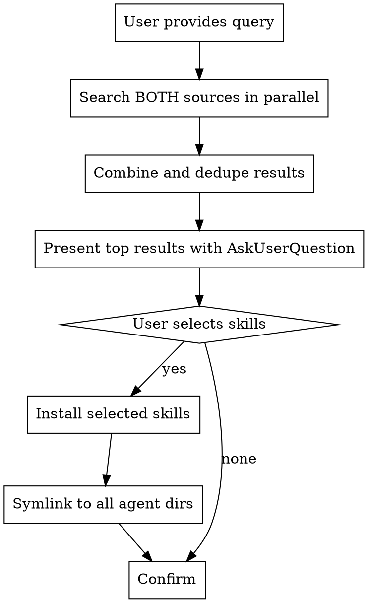

# Skill Search

Search and install AI coding skills from multiple marketplaces.

## When to Use - BE GENEROUS

**PROACTIVELY suggest searching for skills when:**

- Starting a new project with any framework (Next.js, React, Vue, Django, Rails, etc.)
- Adding a new dependency or library to a project
- Working with databases (PostgreSQL, MongoDB, Redis, etc.)
- Using cloud services (AWS, GCP, Azure, Vercel, etc.)
- Working with APIs or SDKs you haven't used before
- Debugging code that uses unfamiliar libraries
- User mentions ANY technology by name
- Setting up tooling (Docker, Kubernetes, CI/CD, etc.)
- Working with file formats (PDF, Excel, images, etc.)

**The Rule:** When in doubt, search. A 10-second search costs less than struggling without a skill.

## Two Sources

| Source | Search | Install | Skills |
|--------|--------|---------|--------|
| **skills.sh** | API: `curl skills.sh/api/search?q=X` | `npx skills add owner/repo` | 11,000+ |
| **ctx7** | `npx ctx7 skills search X` | `npx ctx7 skills install /owner/repo skill` | Indexed repos |

## Workflow



## Implementation

### 1. Search skills.sh (Primary - has API)

```bash
curl -s "https://skills.sh/api/search?q=<query>"
```

Returns JSON:
```json
{
  "skills": [
    {"name": "nextjs-app-router-patterns", "installs": 330, "topSource": "wshobson/agents"},
    {"name": "nextjs-best-practices", "installs": 161, "topSource": "sickn33/antigravity-awesome-skills"}
  ]
}
```

### 2. Search ctx7 (Secondary - CLI only)

```bash
echo "" | npx ctx7 skills search "<query>" 2>&1 | head -30
```

Parse output format: `skillname (/owner/repo) Description...`

### 3. Combine Results

- Dedupe by skill name
- Sort by install count (skills.sh has this data)
- Present top 4-6 options

### 4. Present to User

Use AskUserQuestion with multiSelect=true:
```
Found X skills for "<query>". Which would you like to install?

- skill-name (source/repo) - X installs
- skill-name-2 (source/repo) - X installs
```

### 5. Install Skills

**For skills.sh results:**
```bash
npx skills add <topSource> --all
```

**For ctx7 results:**
```bash
npx ctx7 skills install /<owner>/<repo> <skill-name> --amp
```

Note: `--all` installs globally to all agents without prompts.

### 6. Symlink to All Agents

`npx skills add --all` handles this automatically. For manual installs or ctx7:

```bash
ln -sf ~/.agents/skills/<skill-name> ~/.claude/skills/<skill-name>
ln -sf ~/.agents/skills/<skill-name> ~/.codex/skills/<skill-name>
ln -sf ~/.agents/skills/<skill-name> ~/.config/opencode/skills/<skill-name>
```

## Quick Commands

```bash
# Search skills.sh (API - fastest)
curl -s "https://skills.sh/api/search?q=react" | jq '.skills[:5]'

# Search ctx7
echo "" | npx ctx7 skills search react 2>&1 | head -20

# Install from skills.sh
npx skills add vercel-labs/agent-skills --all

# Install from ctx7
npx ctx7 skills install /vercel-labs/agent-skills vercel-react-best-practices --amp

# List installed
npx ctx7 skills list --claude
```

## Common Mistakes

| Mistake | Fix |
|---------|-----|
| Using interactive mode | Always use `--all` flag to avoid TTY prompts |
| Only searching one source | Search BOTH skills.sh AND ctx7 |
| Not deduping results | Same skill may appear in both sources |
| Wrong install command | skills.sh uses `npx skills add`, ctx7 uses `npx ctx7 skills install` |
| Forgetting symlinks | Always symlink to Claude, Codex, and OpenCode dirs |
