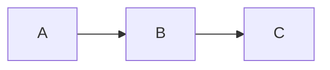

# Drawings in Slidev

This skill covers Slidev's built-in drawing and annotation features powered by drauu, allowing you to draw, highlight, and annotate slides in real-time during presentations.

## When to Use This Skill

- Highlighting important content during presentations
- Drawing diagrams on the fly
- Annotating code or images
- Interactive teaching sessions
- Brainstorming visualizations

## Enabling Drawings

### In Frontmatter

```yaml
---
drawings:
  enabled: true
---
```

### Full Configuration

```yaml
---
drawings:
  enabled: true
  persist: false
  presenterOnly: false
  syncAll: true
---
```

## Drawing Options

| Option | Type | Default | Description |
|--------|------|---------|-------------|
| `enabled` | boolean/string | `true` | Enable drawings (`true`, `false`, `'dev'`) |
| `persist` | boolean | `false` | Save drawings to `.slidev/drawings/` |
| `presenterOnly` | boolean | `false` | Only presenter can draw |
| `syncAll` | boolean | `true` | Sync drawings across all clients |

## Accessing Drawing Tools

### Via UI

1. Click the pen/pencil icon in the navigation bar
2. Drawing toolbar appears

### Toolbar Options

- **Pen**: Freehand drawing
- **Line**: Straight lines
- **Arrow**: Lines with arrowheads
- **Rectangle**: Draw rectangles
- **Ellipse**: Draw circles/ellipses
- **Eraser**: Remove drawings
- **Clear**: Remove all drawings

## Drawing Tools Detailed

### Pen Tool

- Freehand drawing
- Adjustable stroke width
- Color selection

```
Usage: Click and drag to draw
Good for: Underlining, circling, quick annotations
```

### Line Tool

- Creates straight lines
- Hold Shift for horizontal/vertical lines

```
Usage: Click start point, drag to end
Good for: Connecting elements, pointing
```

### Arrow Tool

- Lines with arrowheads
- Directional indicators

```
Usage: Click start, drag to arrow point
Good for: Showing flow, indicating direction
```

### Rectangle Tool

- Draw rectangles/squares
- Hold Shift for perfect squares

```
Usage: Click corner, drag to opposite corner
Good for: Highlighting areas, boxing content
```

### Ellipse Tool

- Draw circles/ellipses
- Hold Shift for perfect circles

```
Usage: Click center, drag to edge
Good for: Circling items, attention markers
```

### Eraser

- Remove specific drawings
- Click on drawing to erase it

```
Usage: Click on drawn elements to remove
Good for: Correcting mistakes, cleaning up
```

## Stylus/Pen Support

### Automatic Detection

Slidev automatically detects stylus input:
- Pressure sensitivity (if supported)
- Palm rejection
- Natural drawing experience

### iPad + Apple Pencil

Works great with:
- Safari on iPad
- Chrome on iPad
- Sidecar (iPad as second display)

## Color and Style

### Changing Colors

Click color selector in drawing toolbar:
- Preset colors available
- Some themes support custom colors

### Stroke Width

Adjust stroke width for:
- Thin lines (precision)
- Thick lines (visibility)

## Persisting Drawings

### Enable Persistence

```yaml
---
drawings:
  persist: true
---
```

### Storage Location

Drawings saved to:
```
.slidev/drawings/[slide-number].svg
```

### Benefits

- Drawings survive page reloads
- Include in exports (PDF, etc.)
- Version control friendly (SVG format)

### Clearing Persisted Drawings

Delete files from `.slidev/drawings/` or:
- Use "Clear" button in drawing mode
- Clear from presenter mode

## Presenter-Only Mode

### Configuration

```yaml
---
drawings:
  presenterOnly: true
---
```

### Behavior

- Only presenter can draw
- Drawings visible to all audiences
- Audience cannot accidentally draw

## Synchronization

### Sync All Clients

```yaml
---
drawings:
  syncAll: true
---
```

All connected clients see drawings in real-time.

### Disable Sync

```yaml
---
drawings:
  syncAll: false
---
```

Only presenter's drawings are synced to audience.

## Best Practices

### 1. Prepare Key Annotations

Know in advance what you'll highlight:

```markdown
<!--
ANNOTATIONS:
- Circle the error on line 5
- Arrow from input to output
- Underline the key term
-->
```

### 2. Use Appropriate Tools

| Need | Tool |
|------|------|
| Highlight text | Pen (underline) |
| Point to something | Arrow |
| Group elements | Rectangle |
| Mark important | Ellipse |

### 3. Color Choices

- **Red**: Errors, warnings, important
- **Green**: Success, correct, good
- **Blue**: Information, notes
- **Yellow**: Highlights (if visible on theme)

### 4. Clean As You Go

- Erase unnecessary drawings before moving on
- Keep drawings minimal and meaningful
- Use "Clear" when starting fresh concept

### 5. Practice Drawing

- Test stylus pressure/speed
- Practice common shapes
- Know your drawing shortcuts

## Keyboard Shortcuts

When drawing mode is active:

| Key | Action |
|-----|--------|
| `1` | Pen tool |
| `2` | Line tool |
| `3` | Arrow tool |
| `4` | Rectangle tool |
| `5` | Ellipse tool |
| `e` | Eraser |
| `c` | Clear all |
| `Esc` | Exit drawing mode |

## Integration with Slides

### Drawing Over Code

```markdown
# Code Review

```python
def calculate(x, y):
    result = x + y  # Circle this line
    return result
```

Draw a circle around the important line during presentation.
```

### Drawing Over Diagrams

```markdown


Use arrows to trace the flow during explanation.
```

### Drawing Over Images

```markdown


Annotate specific components during walkthrough.
```

## Common Patterns

### Highlight and Explain

1. Show slide content
2. Activate drawing mode
3. Circle/underline key points
4. Explain while pointing

### Build Diagram Live

1. Show empty/partial diagram
2. Draw connections as you explain
3. Add labels with rectangles

### Code Walkthrough

1. Display code block
2. Draw arrows showing execution flow
3. Circle variables being discussed
4. Underline return values

### Before/After

1. Draw "X" over old approach
2. Draw checkmark on new approach

## Troubleshooting

### Drawings Not Appearing

1. Check `drawings.enabled: true`
2. Refresh browser
3. Check for CSS conflicts

### Sync Issues

1. Verify `syncAll` setting
2. Check network connection
3. Refresh all clients

### Persistence Not Working

1. Check `persist: true`
2. Verify `.slidev/` directory exists
3. Check file permissions

### Stylus Not Working

1. Check browser compatibility
2. Verify stylus is connected
3. Try different browser

## Output Format

When configuring drawings:

```yaml
---
drawings:
  enabled: true      # Enable drawing feature
  persist: true      # Save drawings between sessions
  presenterOnly: true # Only presenter can draw
  syncAll: true      # Sync to all viewers
---
```

**DRAWING PLAN FOR SLIDE:**
1. [What to draw/highlight]
2. [Tool to use]
3. [Color choice]
4. [When in explanation]

**CLEANUP:**
- Clear before: [yes/no]
- Clear after: [yes/no]
