# PlantUML in Slidev

This skill covers using PlantUML for creating UML and technical diagrams in Slidev. PlantUML excels at creating standard UML diagrams with more detailed control than Mermaid.

## When to Use This Skill

- Creating standard UML diagrams
- Complex sequence diagrams with detailed notation
- Component and deployment diagrams
- Use case diagrams
- Activity diagrams with swimlanes
- C4 architecture diagrams

## Enabling PlantUML

PlantUML is supported via the `plantuml` code block:

````markdown
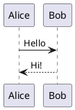
````

## Sequence Diagrams

### Basic Sequence

````markdown
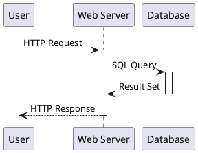
````

### Participant Types

````markdown
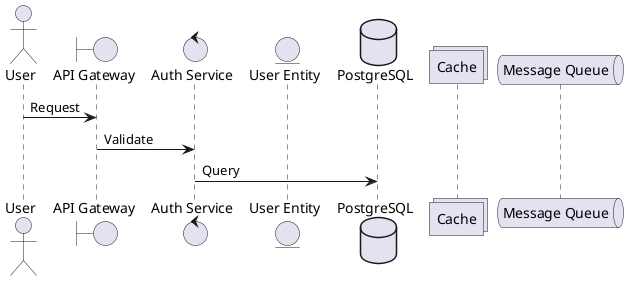
````

### Grouping and Alternatives

````markdown
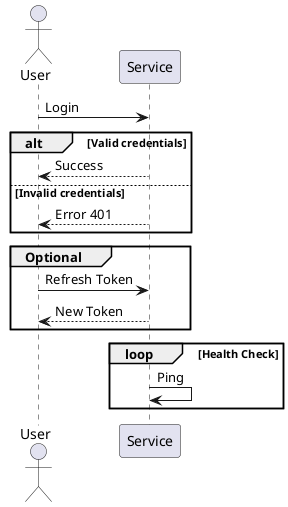
````

### Notes

````markdown
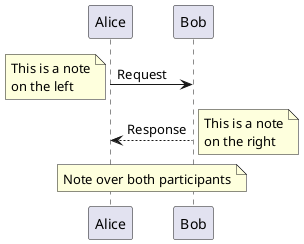
````

## Class Diagrams

### Basic Class

````markdown
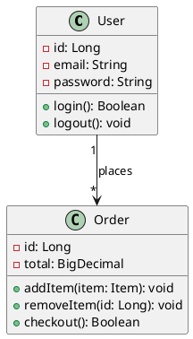
````

### Interfaces and Abstract Classes

````markdown
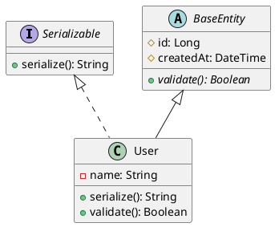
````

### Relationships

````markdown
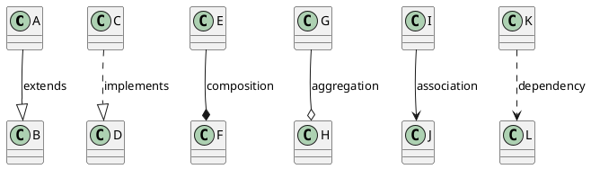
````

### Packages

````markdown
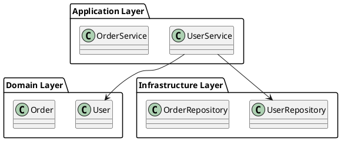
````

## Use Case Diagrams

````markdown
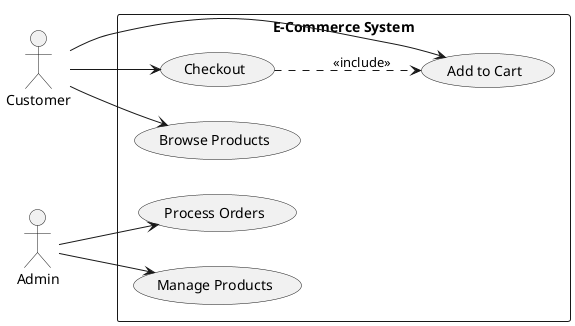
````

## Activity Diagrams

### Basic Flow

````markdown
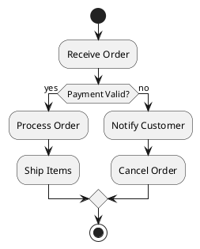
````

### Swimlanes

````markdown
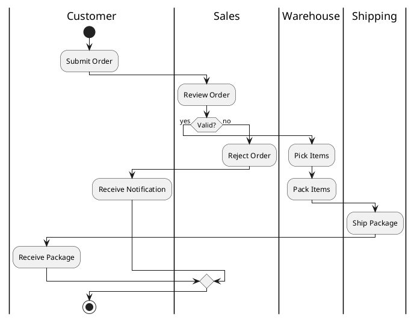
````

### Parallel Processing

````markdown
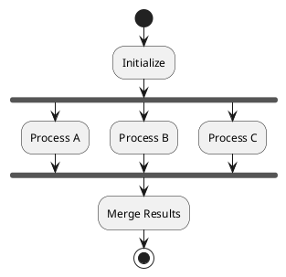
````

## Component Diagrams

````markdown
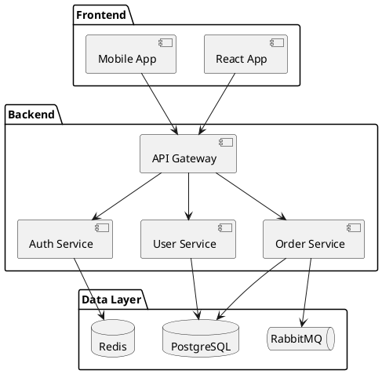
````

## Deployment Diagrams

````markdown
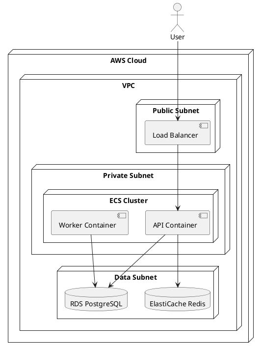
````

## State Diagrams

````markdown
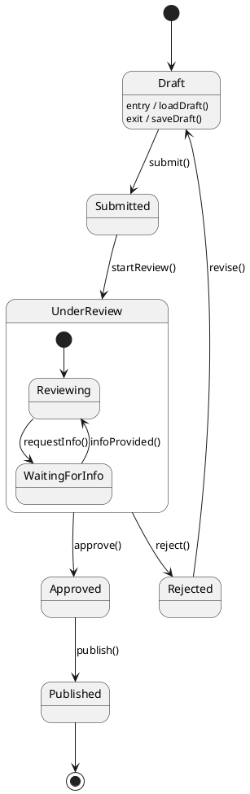
````

## Styling

### Skinparams

````markdown
```plantuml
@startuml
skinparam backgroundColor #f8fafc
skinparam roundCorner 10
skinparam shadowing false

skinparam class {
    BackgroundColor #e0f2fe
    BorderColor #0284c7
    FontColor #0c4a6e
}

skinparam sequence {
    ArrowColor #0284c7
    LifeLineBorderColor #64748b
    ParticipantBackgroundColor #e0f2fe
}

class User {
    +name: String
}
@enduml
```
````

### Themes

````markdown
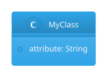
````

Available themes: `cerulean`, `materia`, `minty`, `sandstone`, `sketchy-outline`, and more.

## C4 Model Diagrams

### Context Diagram

````markdown
```plantuml
@startuml
!include https://raw.githubusercontent.com/plantuml-stdlib/C4-PlantUML/master/C4_Context.puml

Person(user, "Customer", "A user of our system")
System(system, "E-Commerce", "Online shopping platform")
System_Ext(payment, "Payment Gateway", "Handles payments")
System_Ext(shipping, "Shipping Provider", "Delivers packages")

Rel(user, system, "Uses")
Rel(system, payment, "Processes payments via")
Rel(system, shipping, "Ships orders via")
@enduml
```
````

### Container Diagram

````markdown
```plantuml
@startuml
!include https://raw.githubusercontent.com/plantuml-stdlib/C4-PlantUML/master/C4_Container.puml

Person(user, "Customer")

System_Boundary(system, "E-Commerce Platform") {
    Container(web, "Web App", "React", "User interface")
    Container(api, "API", "Node.js", "Business logic")
    ContainerDb(db, "Database", "PostgreSQL", "Stores data")
    Container(queue, "Queue", "RabbitMQ", "Async processing")
}

Rel(user, web, "Uses")
Rel(web, api, "API calls")
Rel(api, db, "Reads/Writes")
Rel(api, queue, "Publishes")
@enduml
```
````

## Configuration

### setup/plantuml.ts

```typescript
import { definePlantUmlSetup } from '@slidev/types'

export default definePlantUmlSetup(() => {
  return {
    // Server URL (default uses public server)
    server: 'https://www.plantuml.com/plantuml',
  }
})
```

## Mermaid vs PlantUML

| Feature | Mermaid | PlantUML |
|---------|---------|----------|
| Syntax | Simpler | More verbose |
| UML compliance | Partial | Full |
| Rendering | Client-side | Server-side |
| C4 diagrams | No | Yes |
| Swimlanes | No | Yes |
| Customization | Limited | Extensive |

## Best Practices

1. **Use PlantUML for**: Standard UML, C4, complex diagrams
2. **Use Mermaid for**: Simple flowcharts, quick visualizations
3. **Add skinparams**: Customize for your presentation theme
4. **Keep diagrams focused**: One concept per diagram
5. **Use proper UML notation**: Follow standards for clarity

## Output Format

When creating PlantUML diagrams:

```
DIAGRAM TYPE: [sequence/class/component/etc.]
PURPOSE: [What it illustrates]

```plantuml
@startuml
[skinparams if needed]

[diagram content]

@enduml
```

KEY ELEMENTS:
- [Element]: [What it represents]

NOTES:
- [Any additional context]
```
